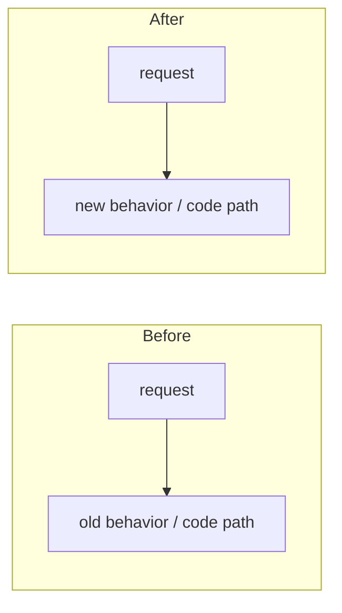

# Darkbloom - Decentralized Private Inference

Darkbloom is a decentralized private inference network for Apple Silicon Macs. Consumers use OpenAI-compatible APIs, the coordinator handles routing, auth, billing, attestation, and capacity management, and providers run local inference workloads on macOS hardware using MLX-Swift. Request bodies are encrypted hop by hop (NaCl Box on each leg): the coordinator decrypts inside its confidential-VM memory for routing and billing, does not log or retain prompt content, and re-seals each request to the provider's attested key; the provider is the plaintext endpoint. Exact model: `docs/architecture/security/encryption.md`. Docs map: `docs/README.md`; docs rules: `docs/AGENTS.md`.

### External dependencies (`.external/`)

The `.external/` directory is reserved for local external checkouts and must
never be committed. The Swift provider uses in-process MLX, not a vllm-mlx
subprocess.

## Provider Onboarding Development

- Read `docs/developer/onboarding-test.md`. Scope: Install → enrollment → account linkage → model selection/download → final Enter-to-start prompt. Require an explicit action before opening enrollment or the login browser; use neutral styling and selective bold, green success and red errors, without blue/cyan accents.
- Keep Bubble Tea opt-in. Use total physical RAM plus existing safeguards for model-fit estimates; support multiple downloads, hide empty Downloaded sections, and keep additional models expandable. Reuse Swift enrollment/login/download logic and preserve the update path for completed installs.
- The human tester runs real installer, reset, enrollment, login and Start commands and approves macOS prompts. Agents prepare builds, inspect logs and run disposable automated tests; never advance the tester's prompts. When providing reset instructions, explain the deletion scope and distinguish fresh setup from resume testing. Full reset removes shared model downloads; cancellation preserves them.
- Local ad-hoc builds test the UI; signed identity acceptance and device trust require separate qualification. Publishing or registering releases, production deployments and fleet changes require explicit authorization. Production service use is governed by the test operator's authorization, not assumed from this guide.

## Project Structure

```text
coordinator/          Go control plane (packages live at top level, not internal/)
├── cmd/coordinator/  main service entrypoint
├── api/              HTTP + WebSocket handlers
│   ├── consumer.go         OpenAI-compatible chat/completions/responses + Anthropic messages
│   ├── provider.go         provider registration, heartbeats, attestation, relay
│   ├── billing_handlers.go Stripe/referral/pricing endpoints
│   ├── device_auth.go      device code flow for linking providers to user accounts
│   ├── enroll.go           MDM enrollment profile generation
│   ├── invite_handlers.go  invite code admin/user flows
│   ├── release_handlers.go binary release registration (GitHub Actions integration)
│   ├── chunk_key_cache.go  per-request X25519 shared-key memoization for chunk decrypt
│   ├── stats.go            public network stats
│   ├── types/              canonical JSON shapes for consumer-facing endpoints
│   └── server.go           route wiring, auth middleware, version gate
├── apns/             APNs-push code-identity attestation
├── attestation/      Secure Enclave + MDA verification
├── auth/             Privy JWT integration
├── billing/          Stripe (deposits + Connect payouts), referrals
├── config/           AppConfig aggregation of per-package configs
├── env/              shared env-var helpers/constants
├── mdm/              MicroMDM client + webhook handling
├── payments/         ledger + pricing (+ baserewards/)
├── profilesign/      CMS-signing of .mobileconfig enrollment profiles
├── protocol/         WebSocket message types shared with provider (type_scan.go: single-parse frame decode)
├── ratelimit/        rate limiting
├── registry/         provider registry, queueing, routing, reputation, token-budget admission,
│                     warm-pool controller, two-lane provider WS writer (provider_writer.go),
│                     routingsim/ (trace-driven routing simulation harness)
├── saferun/          panic-safe goroutine runners
├── stateexport/      consistent encrypted archive of MicroMDM (+ legacy step-ca) state (migration)
├── store/            in-memory or Postgres persistence
├── telemetry/        telemetry event emitter (process logs + Datadog forwarding)
├── datadog/          Datadog APM / DogStatsD / Logs API client
├── deploy/           container entrypoint (start.sh)
└── internal/e2e/     X25519 request-encryption helpers (+ cross-compat/tamper tests)

e2e/                  System-level E2E testing framework
├── integration_test.go  integration coverage for streaming, billing, encryption, and attestation
├── profile_test.go      latency profiling tests
├── benchmark_test.go    load benchmarks (posts markdown to PR comments)
└── testbed/             shared test harness
    ├── coordinator.go       Coordinator lifecycle (start/stop, Postgres helpers)
    ├── provider.go          Provider lifecycle (binary discovery, start/stop)
    ├── config.go            Test configuration (model, provider, request settings)
    ├── suite.go             Suite orchestration (multi-provider, user pools)
    ├── events.go            Event system (segments, buffers, fan-out)
    ├── instrument.go        Request-level instrumentation
    ├── load.go              Load generator (concurrency, streaming, metrics)
    ├── assert/              Latency threshold + accounting integrity assertions
    ├── deps/                External dependency lifecycle (ephemeral Postgres)
    └── profile/             Segment stats aggregation, diffing, JSON export

provider-swift/       Swift provider CLI for Apple Silicon Macs
├── Sources/ProviderCore/             coordinator client, protocol, hardware, security, inference, server, telemetry, model downloads
├── Sources/ProviderCoreFoundation/   model manifests, scanner, weight hashing, template render check, publish-safe foundation code
├── Sources/darkbloom/                CLI (`start`, `stop`, `status`, `models`, `benchmark`, `doctor`, `login`, `local`, etc.)
├── Sources/darkbloom-publish/        registry manifest builder used by publish workflow
├── Sources/darkbloom-enclave-cli/    Secure Enclave attestation/sign helper
├── Sources/ProviderBenchmark*, kv-*  benchmark + KV-cache self-test executables
└── Tests/                            ProviderCore, ProviderCoreFoundation, CLI, and publish tests

console-ui/           Next.js 16 / React 19 frontend
├── src/app/          chat (/), billing, models, stats, providers, settings, link, api-console, earn, login
├── src/app/api/      chat, auth/keys, keys, payments/*, invite, models, health, pricing, stats,
│                     telemetry, attestation, device, encryption-key, leaderboard, me, network, admin
├── src/components/   chat UI, sidebar, top bar, trust badge, verification panel, invite banner
├── src/components/providers/
│   ├── PrivyClientProvider.tsx
│   └── ThemeProvider.tsx
├── src/lib/          API client (src/lib/api/) + Zustand store (store.ts)
├── src/hooks/        auth (useAuth.ts), toast (useToast.ts), chat streaming (useChatStream.ts)
└── src/proxy.ts      Next.js 16 proxy (replaces middleware.ts)

admin-ui/             Next.js 16 internal read-only ops dashboard (SELECT-only queries against the
                      prod read replica; Basic Auth via src/proxy.ts; has vitest tests covered by the
                      `test-admin` CI job)

landing/              static landing page (index.html, earn calculator, network stats)

scripts/              build, signing, install, and deploy helpers
├── install.sh        end-user installer served from coordinator (hash + codesign verification)
├── admin.sh          admin CLI (Privy auth, release mgmt, API calls)
├── publish-model.sh  model registry publish workflow
├── fetch-metallib.sh MLX metallib builder (cmake from libs/mlx-swift source)
├── smoke-dev.sh      dev-coordinator smoke test
├── benchmark-models.py, load_soak.py, …  benchmark + soak helpers
└── entitlements.plist hardened runtime entitlements (network, keychain)

deploy/               infra config: gcp/ (Cloud Build + VM bootstrap), environments/ (dev/prod env),
                      datadog/ (dashboard JSON), provider-fleet/ (fleet update helper)

docs/                 how-tos, runbooks, reference, architecture, design records, dated reports
                      (map: docs/README.md · rules + freshness stamps: docs/AGENTS.md · lint: make docs-check)
.github/workflows/    CI (ci.yml), integration tests (integration.yml), Swift release (release-swift.yml),
                      model registration (register-model.yml), threat model review (threat-model-review.yml)
```

## Current Surface Area

- Coordinator HTTP routes include `POST /v1/chat/completions`, `POST /v1/responses`, `POST /v1/completions`, `POST /v1/messages`, `GET /v1/models`, `GET /v1/models/capacity`, billing/pricing endpoints, invite flows, stats, enrollment, device authorization, and release registration endpoints.
- Coordinator auth is split between Privy JWTs, API keys, and device-code login (RFC 8628) for provider machines.
- Routing uses token-budget admission with engine-reported capacity, speculative TTFT dispatch, EWMA TPS tracking, and early 429 with Retry-After for OpenRouter compatibility.
- Billing logic is split between `coordinator/payments` (ledger + pricing) and `coordinator/billing` (Stripe, referrals).
- Providers serve text inference through the Swift `darkbloom` CLI with continuous batching via MLX-Swift.
- Model registry data is DB-backed in the coordinator and points to R2 manifests under `https://models.darkbloom.ai`; model bytes are not hardcoded in the provider or UI.
- Streaming hot path: provider frames are decoded in a single parse (`coordinator/protocol/type_scan.go` scans the `type` key; malformed input falls back to a full envelope decode); per-request X25519 shared keys are memoized for chunk decryption and forgotten on request terminal (`coordinator/api/chunk_key_cache.go`); all writes to a provider WebSocket go through a two-lane writer (`coordinator/registry/provider_writer.go`) with a per-connection write watchdog — control frames (challenges, cancels, trust status) take strict (non-preemptive) priority over data frames, FIFO holds only within a lane, and `WriteText` blocks until the frame is on the wire.
- Observability: Datadog metrics (DogStatsD) for attestation, routing, billing, fleet version, and provider capacity. X-Timing header decomposes per-request latency.

## Building And Testing

Toolchain versions (Go, Node, Swift, Python, plus `jq`/`gh`/`awscli`/`gcloud`)
are pinned in [`mise.toml`](mise.toml). Build/test commands are wrapped in the
root [`Makefile`](Makefile) — run `make` with no args to list all targets.

### One-time setup
```bash
mise install            # installs every tool pinned in mise.toml
make ui-install         # console-ui npm deps
```

### Coordinator (Go)
```bash
make coordinator-test         # cd coordinator && go test ./...
make coordinator-build        # cd coordinator && go build ./cmd/coordinator
make coordinator-build-linux  # GOOS=linux GOARCH=amd64 CGO_ENABLED=0 build (GCP prod container)
make coordinator              # test + build
```

### Provider (Swift)
```bash
make provider-build           # cd provider-swift && swift build
make provider-test            # cd provider-swift && swift test
make provider                 # build + test
```

The Swift package depends on `../libs/mlx-swift` and `../libs/mlx-swift-lm`
(git submodules). `scripts/fetch-metallib.sh` (and the release workflow)
build `mlx.metallib` from the MLX source **nested inside mlx-swift** —
`libs/mlx-swift/Source/Cmlx/mlx`, the tree the Cmlx target actually compiles
against — NOT from the top-level `libs/mlx` submodule; updating `libs/mlx`
alone does not change the generated kernels.

### Console UI (Next.js 16)
```bash
make ui-install               # npm install
make ui-build                 # npm run build
make ui-lint                  # npx eslint src/
make ui-test                  # vitest (npm test)
make ui                       # install + lint + test + build
```

### Admin UI (Next.js 16)
```bash
cd admin-ui
npm ci
npx eslint src/
npx tsc --noEmit
npm test -- --run
```

### E2E Integration Tests
```bash
# Requires Postgres + Swift provider binary + MLX model downloaded.
make e2e-integration          # go test ./e2e/... -run TestIntegration -v
make e2e-benchmark            # go test ./e2e/... -run TestBenchmark -v
```

### Aggregates
```bash
make test                     # all unit tests (coordinator + provider + ui)
make build                    # build all components
make all                      # test + build everything
make clean                    # remove built artifacts
```

## Releases

**Never create a release unless explicitly asked by the user.** When asked:

1. **Squash push**: All local commits since the last tag should be squash-pushed into a single commit on master.
2. Bump the Swift provider version in
   `provider-swift/Sources/ProviderCore/ProviderCore.swift`.
3. Create an annotated tag:
   ```bash
   git tag -a v0.X.Y -m "v0.X.Y: one-line summary

   - Change 1
   - Change 2"
   ```
4. Push the commit and tag with `git push origin master --tags`.
5. `.github/workflows/release-swift.yml` handles tags shaped `vX.Y.Z` and
   legacy `vX.Y.Z-swift[.N]`; dev publication uses `workflow_dispatch`.
   Requested versions must equal the checked-in source constants.

## Deploying

Full deploy runbook: **[docs/operations/coordinator-deploy.md](docs/operations/coordinator-deploy.md)**

Covers coordinator deploy, provider CLI bundling, and install.sh updates.

### Coordinator (prod, Google Cloud)

> **AI agents must NOT deploy or mutate production.** Any mutation of the
> `darkbloom-mainnet` VM, container, services, Caddy, environment, Secret
> Manager, database, DNS, or traffic is human-only. Agents may prepare the PR,
> image-build config, tag, and exact commands. Read-only health/log inspection
> is allowed.

The prod coordinator runs on GCE VM `darkbloom-coordinator` in
`darkbloom-mainnet`. Build target is `coordinator/Dockerfile`; host Caddy
terminates static TLS. The persistent disk is `/mnt/disks/userdata`.

Human-only deploy flow (for reference — do not run this as the agent):

```bash
# 1. Push your changes (agent may do this if explicitly asked)
git push origin master

# 2. The repository trigger builds and pushes the immutable master commit.
# Direct local gcloud builds submit is rejected by cloudbuild-prod.yaml.
gcloud builds list --project=darkbloom-mainnet --limit=5

# 3. HUMAN ONLY: follow the drain and fallback-container swap runbook.

# 4. Verify (agent may do this)
curl https://api.darkbloom.dev/health
```

See `docs/operations/coordinator-deploy.md` for environment preservation,
deployment, verification, and rollback.

Production GCP deploys, VM/container/service/config/secret mutations, and traffic
changes require explicit human approval for the specific operation. A human
operator or human-approved agent may execute them. Without that approval, agents
may only prepare and push reviewed code and perform read-only health inspection.

### Coordinator (dev, Google Cloud)

The dev coordinator runs on GCP (project `sepolia-ai`) — separate domain (`api.dev.darkbloom.xyz`), separate R2 bucket (`d-inf-app-dev`), **same** trust level as prod (`MIN_TRUST=hardware`, full MDM stack), and a dev-only BIP39 mnemonic (never prod's). **Never** used for prod traffic. Full wiring in [docs/operations/dev-environment.md](docs/operations/dev-environment.md).

Shape: GCE Ubuntu VM + Docker + systemd (coordinator + MicroMDM need persistent disk state), Cloud SQL Postgres via cloud-sql-proxy, **Vercel**-hosted console UI, Cloud Build auto-deploys on master push. ~2–4 min coordinator upgrades.

### Provider bundle

CI (`.github/workflows/release-swift.yml`) builds, signs, notarizes, and uploads the Swift CLI bundle to Cloudflare R2 (`s3://d-inf-app/releases/v{VERSION}/darkbloom-bundle-macos-arm64.tar.gz`), then registers the release with the coordinator via `POST /v1/releases`. Providers fetch via `install.sh` served by the coordinator. There is no SSH-to-a-VM step.

Current release-sensitive pieces:

- Prod coordinator runs on the GCE VM `darkbloom-coordinator` in the
  `darkbloom-mainnet` project at `api.darkbloom.dev`. Build target:
  `coordinator/Dockerfile`. Dev runs in the separate `sepolia-ai` project.
- Provider bundle creation (staging, .app wrapping, signing, notarization) lives inline in `.github/workflows/release-swift.yml` (bundle steps ~341-617); there is no standalone bundling script.
- Installer flow lives in `scripts/install.sh`.
- Provider update checks read the latest registered release from the store (CI registers via `POST /v1/releases`). The installer and `darkbloom update` hit `GET /v1/releases/latest`, which returns **404 when no release row exists** — a missing/mis-registered release row breaks installs and self-updates and is fixed by registering the release, not by bumping code. `LatestProviderVersion` in `coordinator/api/server.go` is only the no-release-row fallback for the version *display* path and must stay in sync with `ProviderCore.version`.
- CI release workflow (`release-swift.yml`) signs binaries with Developer ID Application cert, notarizes with Apple, computes SHA-256 hashes after signing, embeds provisioning profile in .app bundle.

## Infrastructure

| Component | Production | Development |
|-----------|------------|-------------|
| Coordinator host | GCE VM `darkbloom-coordinator` (`darkbloom-mainnet`, `us-east4-a`) | GCE VM `d-inference-dev` (us-central1-a, Ubuntu + Docker + systemd) |
| Console UI | Vercel | Vercel (separate dev project, `NEXT_PUBLIC_COORDINATOR_URL=https://api.dev.darkbloom.xyz`) |
| Domain | `api.darkbloom.dev` | `api.dev.darkbloom.xyz` |
| TLS | Host Caddy + pre-provisioned static certificate | Host Caddy (Let's Encrypt ACME, VM :443) |
| Database | AWS RDS PostgreSQL (managed) | Cloud SQL Postgres 16 `d-inference-dev-db` via cloud-sql-proxy sidecar |
| Persistent storage | GCE persistent disk at `/mnt/disks/userdata` | GCE persistent disk `d-inference-dev-data`, 30 GB, mounted at `/mnt/disks/userdata` |
| Logs | Docker JSON logs + hourly host archival/direct Datadog submission | `gcloud logging read ...` (VM + Cloud SQL in Cloud Logging) |
| Release bucket | R2 `d-inf-app` | R2 `d-inf-app-dev` |
| Trust level | `hardware` (MDM enrollment required) | `hardware` (same — full MDM stack) |
| Provider install | `curl -fsSL https://api.darkbloom.dev/install.sh \| bash` | `curl -fsSL https://api.dev.darkbloom.xyz/install.sh \| bash` |

## Key Design Decisions

- **Token-budget routing**: Providers report real token budget usage (active tokens, max potential, EWMA decode TPS) in heartbeats. Coordinator uses engine-reported capacity for admission, with fleet median TPS as fallback. Speculative TTFT dispatch sends to a backup provider at 50% of the deadline; first token wins, loser is cancelled. Early 429 with Retry-After for OpenRouter compatibility.
- **Provider selection**: cost-based, not multiplicative scoring — candidates are ranked by estimated completion cost in ms (effective decode TPS degraded by current batch load) plus penalties for queue depth, pending requests, slot state, and live system metrics from heartbeats (memory pressure, CPU, GPU utilization, thermal state); near-tie candidates are spread randomly (`registry/scheduler.go`).
- **Continuous batching**: All concurrent requests merged into one batched forward pass per step via MLX-Swift BatchedEngine. Near-linear throughput scaling (B=4/B=1 = 3.8x on Qwen, 2.9x on Gemma MoE). Temperature=0 uses vectorized greedy fast path.
- **Request cancellation**: In-flight inference requests are tracked by request_id with cancellation state. On coordinator disconnect, in-flight requests are cancelled so generation stops promptly.
- **Idle GPU timeout**: Loaded model state is released after 1 hour of no requests to free GPU memory. Lazy-reloaded when the next request arrives. Coordinator can also push `load_model` messages to pre-warm providers.
- **Hop-by-hop encryption**: consumer → coordinator is TLS plus optional NaCl Box sealing (`application/eigeninference-sealed+json`); coordinator → provider is a mandatory per-request NaCl Box to the provider's attested X25519 key; provider → coordinator response chunks are encrypted back. The coordinator decrypts consumer bodies in confidential-VM memory for routing and billing and does not log or retain them; the sealed request is decrypted only inside the hardened provider process. Do not write "the coordinator never sees plaintext" — see `docs/architecture/security/encryption.md`.
- **Attestation chain**: Secure Enclave P-256 key (persistent, keychain access group bound) → signs attestation blob → coordinator verifies signature (self_signed) → MDM SecurityInfo cross-check (hardware trust) → Apple Enterprise Attestation Root CA signs device cert chain via MDA (mda_verified). `GET /v1/providers/attestation` exposes only privacy-redacted trust status; hardware serials, UDIDs, and raw Apple certificates stay private to providers and the coordinator.
- **Protocol symmetry**: `provider-swift/Sources/ProviderCore/Protocol/` and `coordinator/protocol/messages.go` define the same WebSocket message types. Changes to one must be mirrored in the other.
- **Model registry**: Coordinator registry data is DB-backed and points to R2 manifests. The Swift provider downloads the files listed in the manifest from `https://models.darkbloom.ai` and verifies per-file plus aggregate SHA-256. Do not reintroduce hardcoded model catalog lists.
- **Billing**: Stripe Checkout deposits credit an internal micro-USD ledger (`coordinator/payments`); Stripe Connect handles provider payouts/withdrawals. Referral system gives referrers a share of platform fees; base rewards live in `payments/baserewards`. (Solana deposits/payouts were removed; the BIP39 mnemonic env var now only derives the coordinator's X25519 encryption key.)
- **Request queue**: When all providers are busy, requests queue with 120s timeout. Frontend shows "providers are busy" on 503. 429 with Retry-After returned when fleet is at capacity.
- **Pre-content failover**: The dispatch loop does NOT commit to a provider on boilerplate chunks (role-only delta, `response.created`) — only on the first content-bearing chunk. A provider that errors or disconnects before producing content is retried invisibly on another provider (`status:retry_precontent`); in-band SSE errors are only possible after real content has flowed (`inference.in_band_error` metric). Repeated 5xx from a (provider, model) pair triggers a 5-min routing cooldown (2 in 60s, `registry/error_cooldown.go`); retries soft-prefer a different provider binary version. The coordinator also normalizes tool JSON-Schemas (`api/toolschema.go`, mirror of the Swift `ToolSchemaNormalization`) before encryption so lagging providers never see template-crashing shapes, and routes tool-bearing requests only to providers ≥ the `tools` capability floor (0.6.3) whose models don't report `template_render_ok=false` (set by the provider's scan-time chat-template render self-check, `TemplateRenderCheck`).
- **Challenge timing**: Initial attestation challenge sent immediately on provider registration, then every 5 minutes via ticker.
- **Model scan performance**: `ModelScanner` does fast discovery without hashing. Weight hash computed on-demand via `WeightHasher.computeHash(for:)` only for models that need attestation/verification.
- **Vision prefill is per-image**: Qwen3-VL's tower attends over whatever it is handed as one sequence with an N×N intermediate, so `EngineV2VisionTowerRun` drives it once per image and evaluates each before building the next. Batching a request's images made peak device memory quadratic in the image count and asked Metal for buffers many times `MTLDevice.maxBufferLength`, which MLX's default `fatalError` handler turned into a dead daemon. `VisionTowerBudget` predicts that peak from the processor's grids and the model's own vision config (the N² multiple is 1 when MLX fuses the head dim, `numHeads` when it falls back to `[1, H, N, N]` scores); the prefill runs under `MLX.withError`, whose handler records and returns — so every `eval` site checks the box rather than relying on the block-exit check.
- **Streaming hot path**: provider frames are decoded in a single parse (`coordinator/protocol/type_scan.go`, envelope-decode fallback); per-request X25519 shared keys are memoized for chunk decrypt and forgotten on request terminal (`api/chunk_key_cache.go`); provider WebSocket writes go through a two-lane writer (`registry/provider_writer.go`) — control frames (challenges, cancels) take strict non-preemptive priority over data frames, FIFO within a lane only, `WriteText` blocks to wire completion. A full consumer chunk buffer gets one 250ms grace window, then the request fails with 499 — chunks are never silently dropped.
- **Device auth**: RFC 8628 device code flow for linking provider machines to user accounts. Provider runs `login`, gets a code, user enters it on the web.
- **CI code signing**: GitHub Actions release workflow signs provider binary with Developer ID Application cert, notarizes with Apple, computes SHA-256 hashes after signing. Provisioning profile embedded in .app bundle for persistent SE key.
- **Observability**: Datadog DogStatsD metrics for attestation, routing, billing, fleet version, provider capacity. X-Timing JSON header decomposes per-request latency (parse, reserve, route, queue, encrypt, dispatch, provider).

## Important Sync Points

- Protocol changes must be mirrored in both `provider-swift/Sources/ProviderCore/Protocol/` and `coordinator/protocol/messages.go`.
- Telemetry wire types live in three places and MUST stay aligned:
  - `coordinator/protocol/telemetry.go` (canonical),
  - `provider-swift/Sources/ProviderCore/Telemetry/` (Swift mirror),
  - `console-ui/src/lib/telemetry-types.ts` (TS mirror).
  Symmetry tests in each language pin enum casing and optional-field omission.
  Field allowlist additions need parallel updates in
  `coordinator/api/telemetry_handlers.go`,
  `provider-swift/Sources/ProviderCore/Telemetry/`, and the TS set above.
- If you change provider bundle semantics, keep the bundle steps in `.github/workflows/release-swift.yml`, `scripts/install.sh`, and `LatestProviderVersion` in sync.
- If you change install paths or process invocation, update both the CLI and install flow.
- Device linking changes often span both coordinator device auth endpoints and the provider `login` / `logout` commands.
- Model registry changes span coordinator registry schema/endpoints, `provider-swift` manifest download/publish code, `scripts/publish-model.sh`, and the console UI. Do not add hardcoded provider `MODEL_CATALOG` lists.

## Common Pitfalls

- Telemetry wire types are mirrored in three places: `coordinator/protocol/telemetry.go`, `provider-swift/Sources/ProviderCore/Telemetry/`, and `console-ui/src/lib/telemetry-types.ts`. The field allowlist (`coordinator/api/telemetry_handlers.go`) is the privacy backstop — never add prompt/completion fields. See `docs/architecture/telemetry.md`.
- Attestation minimum-requirement checks (Secure Enclave, SIP, Secure Boot) run sequentially and each overwrites `result.Error` — last failure wins. `AuthenticatedRootEnabled` (ARV) is informational only: logged, not enforced.
- `coordinator/coordinator` may exist locally as a build artifact (it is gitignored, not tracked). Do not model changes from it, and never commit binaries or other built artifacts.
- CI release workflow must compute binary SHA-256 hashes AFTER code signing, not before. Providers verify hashes of the signed binary.
- Model scan uses fast discovery (no hashing) at startup (`ModelScanner`). Weight hashing is on-demand via `WeightHasher.computeHash(for:)` only for models that need attestation/verification. Don't add hashing back to the scan path.
- Models with broken chat templates are not auto-repaired. The provider runs a scan-time chat-template render self-check (`TemplateRenderCheck`) and reports `template_render_ok=false`; the coordinator then fences **all** requests (plain text, tools, multimodal alike) away from that (provider, model) pair — a crashing template breaks every request shape (`providerEligibleForTraitsLocked`, `coordinator/registry/request_traits.go`). Only the capability *version floors* are tool-scoped.
- The vision tower is driven **one image at a time** (`EngineV2VisionTowerRun.qwenPerImageVisionFeatures`). Qwen3-VL's tower attends over whatever it is handed as one sequence with an N×N intermediate, so batching a request's images made peak device memory quadratic in the image count and asked Metal for buffers many times `MTLDevice.maxBufferLength`. Do not "optimize" the loop back into a single call. `VisionTowerBudget` predicts that peak from the processor's grids and the model's own vision config — the N² multiple is 1 when MLX can fuse the head dim (64/80/128, `sdpa_full_supported_head_dim`) and `numHeads` when it falls back and materializes `[1, H, N, N]` scores — and the whole prefill runs under `MLX.withError` because MLX's default handler is `fatalError`. That handler **records and returns**, so every `eval` site must check the box (`throwIfMLXFaulted`); checking only on block exit lets the code run on after a refused allocation and lets a later Swift throw hide the cause.
- Store selection (`coordinator/cmd/coordinator/main.go`): the coordinator uses the **Postgres** store whenever `EIGENINFERENCE_DATABASE_URL` is set (prod does — durable across restarts/deploys), and refuses to start without it unless `EIGENINFERENCE_ALLOW_MEMORY_STORE=true`. The in-memory store is the dev/test fallback only (state lost on restart). Note: the live provider *registry* (WebSocket connections/attestation) is always in-process and is rebuilt on reconnect regardless of store.
- Coordinator request-queue timeout is 120 seconds. Initial attestation challenge is sent immediately on registration, then every 5 minutes.
- Provider backend idle unload is 1 hour, not 10 minutes.
- `handleChunk` never silently drops streamed chunks: when a consumer's chunk buffer is full it gets one 250ms grace window (`chunkOverflowGrace`), then the request is failed with 499 and the provider's generation is cancelled.
- `hypervisor_active` is retired (#492): current providers no longer send it, but `AttestationResponseMessage.HypervisorActive` and the canonical-status support must keep decoding so signed payloads from older (< v0.6.31) providers still verify. Remove only once the fleet version floor passes v0.6.31.

### Coordinator State Model — Multiple Overlapping Views

Provider state lives in several fields that are read by different code paths with different precedence rules. When mutating any of these, trace every reader:

- `BackendCapacity.Slots` is **authoritative** for the scheduler when present (Swift providers). The scheduler derives `slotState`, `modelLoaded`, token budgets, and observed TPS from it. `WarmModels` is only a fallback for legacy providers without `BackendCapacity`.
- `WarmModels` is updated by heartbeats. It is NOT consulted by `snapshotProviderLocked` or `buildCandidateWithReason` when `BackendCapacity` is non-nil. `TriggerModelSwaps` / `hasWarmProviderLocked` checks it as a fallback, and `/v1/me/providers` copies it into API responses.
- `CurrentModel` is set from heartbeat `active_model`. A nil/omitted `active_model` means no model is loaded. Stale `CurrentModel` can cause attestation hash mismatches.
- `pendingModelLoads` is checked by `TriggerModelSwaps` planning, cold-spill eligibility (`coordinator/registry/cold_dispatch.go`), and the warm-pool controller's target math. It is NOT checked by `QuickCapacityCheck`, `ReserveProviderEx`, or `freeMemoryAdmits` — do not assume pending-load state affects routing admission.
- Provider-reported slot states include `"running"` (active requests), `"idle"` (loaded, no requests), `"crashed"`, `"reloading"`, and `"idle_shutdown"`. The `"idle"` state means the model IS loaded — treat it the same as `"running"` for warm detection, not as `"unknown"`.
- Providers can hold up to `maxModelSlots` models simultaneously (default 3). Do not assume a model swap evicts all other models.
- The provider's memory model is `UnifiedMemoryCap` (`provider-swift/Sources/ProviderCore/Inference/UnifiedMemoryCap.swift`): hard cap = 0.90 × physical RAM (always leaving ≥ 2 GiB for the OS; `DARKBLOOM_MEM_CAP_FRACTION` override). The model-load gate requires resident weights + incoming weights + headroom (the resolved activation reserve plus 1 GiB minimum KV) ≤ the cap, and a post-load guard unloads a freshly-loaded model whose measured live KV headroom is below the minimum serveable KV. The weights figure at EVERY admit-time gate (load gate, pending-load reservation, startup preload, doctor, and the coordinator's `reportedFreeForLoadAdmits`) is the scanner's padded estimate (disk × 1.2) for every model — the padding covers the LOAD TRANSIENT (shard staging exceeds steady residency). Measured post-load residency lives only in the coordinator's `servabilityMeasuredResidentGiB` (text-only artifacts; canonical values re-measured per engine release, see docs/reports/2026-08-30-activation-floor-measurements.md) and feeds only `coldTokenBudgetEstimate` — the POST-load token-budget arithmetic that converges to warm reports. The `DARKBLOOM_ACTIVATION_RESERVE_GB` env override is **raise-only against the resolved floor**; only programmatic `activationReserveBytes` values (tests) are honored as given.
- The activation reserve inside that cap resolves **per serving set** (≥ the per-model release): `resolvedActivationReserveBytes(modelIDs:)` takes the max over advertised ∪ resident ∪ loading models of each member's **measured floor** (`measuredActivationFloorsBytes`, exact catalog-id match) with the flat 5.5 GiB default for any unmeasured member — so one unmeasured model pins the default, and vision-capable models deliberately have NO measured floor until a vision-inclusive peak is measured (the tower transient rides this reserve; text-decode evidence alone must not lower it). The resolved reserve threads through the load gate, `KVHeadroomProbe`, `GlobalKVCacheBudget` (epoch-stamped pushes — cross-actor delivery is not FIFO), engine KV grants, the heartbeat clamp, `free_for_load_gb`, and doctor **in lockstep**; a consumer left on the flat figure re-creates the admit-then-fail class this design removed. `coordinator/registry/servability.go` mirrors both tables (`servabilityActivationFloorGB` default + `servabilityModelActivationFloorsGB`, selected per (version, model) by `servabilityActivationFloor`; regimes: 3 GiB pre-0.8.0/unknown, flat 5.5 for 0.8.0 ≤ v < `servabilityPerModelFloorMinVersion`, per-model table above it — fail-open toward the larger legacy budget). **The provider table and the coordinator mirror must move in the same commit**, floors and measured weights alike; retuning either side alone silently desyncs admission (the historical score-tensor surcharge incident). A per-SHAPE/formula reserve remains banned on both sides — floors are measured constants, never modelled; the measurement convention must include a ≥ 4k-token B=8 cell (short-prompt cells under-measure the saturated envelope — see `docs/reports/2026-08-30-activation-floor-measurements.md`).

### Coordinator Mutation Checklist

When adding code that mutates provider state or sends commands (`load_model`, etc.):

1. Enumerate every reader of the fields you're mutating (`BackendCapacity.Slots`, `WarmModels`, `CurrentModel`, `pendingModelLoads`).
2. Check what happens on the failure path — does state get cleaned up on disconnect, timeout, and load failure?
3. Check concurrent access — heartbeats arrive per-provider on separate goroutines; `TriggerModelSwaps` can race with `drainQueuedRequestsForModels`.
4. Check the cleanup path — `Disconnect()` must clear any per-provider state you add.
5. Verify pre-existing invariants: `maxModelSlots`, heartbeat field omission semantics (`nil` vs empty), and the `UnifiedMemoryCap` load gate on the provider side.
6. **Store read-through cache** (`coordinator/store/cached.go`): `CachedStore` serves `GetUserByAccountID`/`GetUserByPrivyID` and `GetModelRegistryRecord`/`GetModelManifest` from memory and invalidates on the store mutators it overrides. Any NEW `store.Store` method that writes the `users` table or the model-registry tables must be overridden in `CachedStore` to invalidate its domain, or callers read stale data for up to the TTL. Backend-only capabilities discovered by type assertion must go through `store.As` (the decorator implements `Unwrap`).

## Deletion gate (mandatory before removing any symbol/file)

Before deleting anything, record evidence for every search below and confirm the
premise in both production code and tests:

1. Search the symbol name, including `provider-swift/Tests/`, `*_test.go`, fixtures, and
   benchmarks.
2. Search accessors, methods, inferred-type uses, protocol/interface
   requirements, Codable fields, JSON tags, route strings, reflection strings,
   and environment-variable names.
3. Search config defaults and shipped manifests under `deploy/`.
4. Search scripts, docs, workflows, and `Makefile`.

The compiler, `knip`, and `deadcode` identify leads, not proof. Three failures
from the paged-KV migration define the gate: a struct default describes only an
absent JSON key, not a shipped checkpoint; production-dead code can still be a
load-bearing test fixture; and an inferred return type can have live consumers
without naming the type. Grep provider test directories separately from
production sources.

Protocol compatibility, test coverage, and wire-contract decoding take priority
over apparent reachability. The `DARKBLOOM_CBV2_PAGED_KV=0` rollback path remains
supported until the paged backend is stable. Protocol changes still land in both
`provider-swift/Sources/ProviderCore/Protocol/` and `coordinator/protocol/`.

The migration journal's historical wave-ordering rules and shared-worktree
operating rules were not carried forward: their referenced wave files and local
worktree paths are no longer present or are not general repository guidance.

## Problem-Solving Approach

Always think from first principles. When fixing a bug or designing a feature:

1. **Identify the root cause, not the symptom.** Don't patch the immediate error — ask "why does this happen?" repeatedly until you hit the fundamental cause. A hash mismatch isn't the problem; the problem is that CI and providers see different files.

2. **Enumerate the full state space.** Before implementing, ask: "What are ALL the possible states/file types/paths/scenarios?" Don't discover edge cases one at a time through production failures. For example: if hashing a directory, list every file type that could exist (.py, .so, .dylib, .pyc, .json, dirs) and decide how each is handled BEFORE writing code.

3. **Work both top-down and bottom-up.** Top-down: what's the user-visible guarantee we're providing? Bottom-up: what does the code actually do at each step? Find where they diverge.

4. **Simulate the full lifecycle locally before shipping.** Don't assume CI → provider → runtime will work. Actually run the full flow: build the artifact, extract it, hash it, simulate imports, hash again, compare. Verify the invariant holds end-to-end.

5. **Ask "what breaks next?" after every fix.** If you exclude .pyc from hashing, what can an attacker do with .pyc? If you purge before hashing, what regenerates .pyc between purge and the next check? Each fix must not create a new hole.

6. **Pull the thread on every component.** When debugging a failure, map every component in the chain (coordinator → provider → inference engine). Trace the actual flow step by step — look at real logs, real source code, real API responses at each boundary. When you see a specific error, immediately ask "what causes that exact status code in that exact server?" and trace it to the source. Don't theorize about what MIGHT be wrong — verify what IS wrong. The error message IS the clue — follow it.

## Testing New Features

Every new feature or non-trivial change must ship with tests. Don't rely on "the reviewer will catch it" or "I'll test it manually once" — write tests that a future change can run.

- **Prefer live-isolated tests over mocks.** Spin up a real instance of the dependency in the test process or a throwaway local container (test Postgres via `pgx` + a temp database, a real in-process HTTP server via `httptest.NewServer`, a real in-memory store). Do NOT mock the thing you're actually trying to exercise — mocks hide real bugs (wrong SQL, stale schema, protocol drift). The lesson from past incidents: mocked tests passed while the prod migration failed.
- **Never point tests at production.** No live coordinator, no prod DB, no real wallets, no real Privy tenants. Each test harness builds its own isolated coordinator, its own in-memory or ephemeral store, its own seed data. If a test needs credentials, they're fake fixtures, not the real ones.
- **Cover both impls when a feature spans backends.** If a `store.Store` method gets a memory impl AND a postgres impl, both need coverage (memory in the default test suite; postgres behind a build tag or a local-only integration test that uses a throwaway DB).
- **Test the real HTTP path when possible.** For new endpoints, exercise them through `httptest.NewServer(srv.Handler())` (or the equivalent) — not by calling the handler function directly. That catches routing mistakes, middleware gaps, and path-parameter bugs.
- **Frontend features need frontend tests.** When adding a page or form, add at minimum a vitest for the component's validation + state. For UI that can't be easily unit-tested, boot the dev server and walk through the flow in a browser before declaring done — and say so in the handoff.
- **Regression: every bug fix gets a test that fails without the fix.** Otherwise the bug can come back silently.

The goal is "next engineer can change this and CI tells them if they broke it," not "it worked on my machine today."

## Quality Gate

After completing each objective (task, plan phase, or discrete unit of work), first do a modular refactor pass on any large change (see **Code Structure & Modularity**), then spawn **both** reviewers in parallel:

1. **Codex rescue subagent** (`codex:codex-rescue`) — reviews the diff for correctness, regressions, and build/test pass
2. **Claude Code subagent** (`Agent` tool, general-purpose) — independently reviews the same diff for correctness, edge cases, and code quality

Each reviewer should:

1. Read the diff of all changes made for that objective
2. Verify correctness: does the implementation actually solve what was asked?
3. Check for regressions: broken imports, missing protocol symmetry, untested edge cases
4. Confirm builds/tests pass for affected components (run `go test`, `swift test`, `npm run build`, etc. as appropriate)
5. Confirm the docs moved with the code: the table in `docs/AGENTS.md` ("When you change code, change these docs") names the page for each kind of change; changed pages are restamped (`make docs-stamp FILES=...`) and `make docs-check` passes
6. Report a pass/fail verdict with specific issues if any

Only proceed to the next objective after both reviewers pass. If either flags issues, fix them before moving on.

## Code Structure & Modularity

Keep the codebase modular, never monolithic.

- Prefer small, single-responsibility files over large catch-all ones. Split by concern: types, pure helpers, data/IO hooks, UI pieces, and a thin orchestrator that wires them together.
- Group a feature's files into a dedicated module/folder with a thin entry point. Examples: the coordinator's top-level Go packages (`coordinator/registry/`, `coordinator/billing/`, `coordinator/store/`), and `console-ui/src/components/api-keys/` (`constants`, `format`, `limits`, `Modal`, `KeyForm`, `KeyCard`, a `useApiKeys` data hook, and a thin `ApiKeysManager` orchestrator).
- One file/component should do one thing. If a file mixes several concerns or grows past a few hundred lines, that's a signal to split it.
- **At the end of every large piece of work, do a refactor pass to make it modular before calling it done.** Extract helpers/types/hooks into focused files, delete dead code, and keep the public entry point thin. The refactor must be behavior-preserving — build, lint, and tests stay green.

## Pull Requests

**Every PR MUST include a before-and-after diagram (Mermaid) in its description** that details what changed — covering BOTH:

- **Behavior**: the request/response flow, states, and outcomes a user or caller observes (e.g. dispatch → retry → 429/503/200).
- **Code**: which functions/components changed and how control flows through them.

Use two clearly labeled diagrams — a **Before** and an **After** — (or one side-by-side comparison) so a reviewer sees the delta at a glance. Scope it to what the PR changes; it is not a full-system map. A PR without a before/after diagram is not ready for review.

````markdown

````

## Git Hooks

Hooks live in `.githooks/` and are enabled via `git config core.hooksPath .githooks` (already set for this repo).
The pre-commit hook in `.githooks/pre-commit` checks staged files only.

- **pre-commit**: Checks formatting on staged files only (fast).
- **pre-push**: Runs formatting + compilation + tests for changed components.

| Component | Check | Manual fix |
|-----------|-------|------------|
| Go (coordinator/) | `gofmt -l` | `gofmt -w <file>` |
| TypeScript (console-ui/) | `npx eslint src/` | `cd console-ui && npx eslint src/ --fix` |
| Swift (provider-swift/) | skipped | `cd provider-swift && swift test` |

If you clone fresh, activate the hook with:
```bash
git config core.hooksPath .githooks
```
