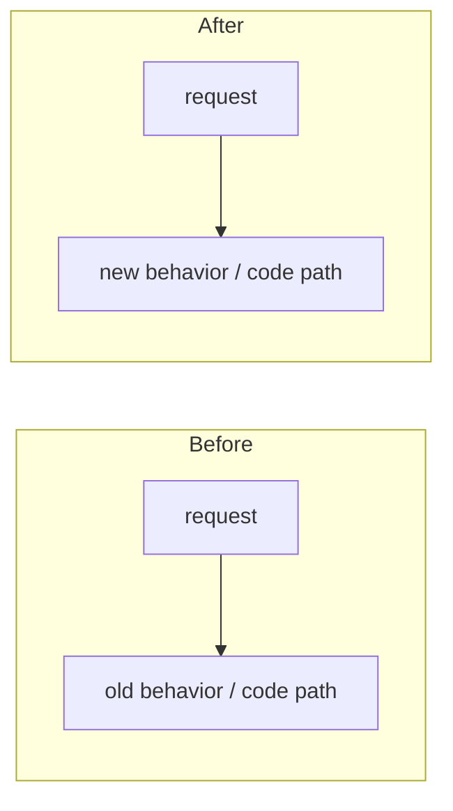

# Darkbloom - Decentralized Private Inference

Darkbloom is a decentralized private inference network for Apple Silicon Macs. Consumers use OpenAI-compatible APIs, the coordinator handles routing, auth, billing, attestation, and capacity management, and providers run local inference workloads on macOS hardware using MLX-Swift. Request bodies are encrypted hop by hop (NaCl Box on each leg): the coordinator decrypts inside its confidential-VM memory for routing and billing, does not log or retain prompt content, and re-seals each request to the provider's attested key; the provider is the plaintext endpoint. Exact model: `docs/architecture/security/encryption.md`. Docs map: `docs/README.md`; docs rules: `docs/AGENTS.md`.

### External dependencies (`.external/`)

The `.external/` directory is reserved for local external checkouts and must
never be committed. The Swift provider uses in-process MLX, not a vllm-mlx
subprocess.

## Provider Onboarding Development

- Read `docs/developer/onboarding-test.md`. Scope: Install → enrollment → account linkage → model selection/download → final Enter-to-start prompt. Require an explicit action before opening enrollment or the login browser; use neutral styling and selective bold, green success and red errors, without blue/cyan accents.
- Keep Bubble Tea opt-in. Use total physical RAM plus existing safeguards for model-fit estimates; support multiple downloads, hide empty Downloaded sections, and keep additional models expandable. Reuse Swift enrollment/login/download logic and preserve the update path for completed installs.
- The human tester runs real installer, reset, enrollment, login and Start commands and approves macOS prompts. Agents prepare builds, inspect logs and run disposable automated tests; never advance the tester's prompts. When providing reset instructions, explain the deletion scope and distinguish fresh setup from resume testing. Full reset removes shared model downloads; cancellation preserves them.
- Local ad-hoc builds test the UI; signed identity acceptance and device trust require separate qualification. Publishing or registering releases, production deployments and fleet changes require explicit authorization. Production service use is governed by the test operator's authorization, not assumed from this guide.

## Project Structure

```text
coordinator/          Go control plane (packages live at top level, not internal/)
├── cmd/coordinator/  main service entrypoint
├── api/              HTTP + WebSocket handlers
│   ├── consumer.go         OpenAI-compatible chat/completions/responses + Anthropic messages
│   ├── provider.go         provider registration, heartbeats, attestation, relay
│   ├── billing_handlers.go Stripe/referral/pricing endpoints
│   ├── device_auth.go      device code flow for linking providers to user accounts
│   ├── enroll.go           MDM enrollment profile generation
│   ├── invite_handlers.go  invite code admin/user flows
│   ├── release_handlers.go binary release registration (GitHub Actions integration)
│   ├── chunk_key_cache.go  per-request X25519 shared-key memoization for chunk decrypt
│   ├── stats.go            public network stats
│   ├── types/              canonical JSON shapes for consumer-facing endpoints
│   └── server.go           route wiring, auth middleware, version gate
├── apns/             APNs-push code-identity attestation
├── attestation/      Secure Enclave + MDA verification
├── auth/             Privy JWT integration
├── billing/          Stripe (deposits + Connect payouts), referrals
├── config/           AppConfig aggregation of per-package configs
├── env/              shared env-var helpers/constants
├── mdm/              MicroMDM client + webhook handling
├── payments/         ledger + pricing (+ baserewards/)
├── profilesign/      CMS-signing of .mobileconfig enrollment profiles
├── protocol/         WebSocket message types shared with provider (type_scan.go: single-parse frame decode)
├── ratelimit/        rate limiting
├── registry/         provider registry, queueing, routing, reputation, token-budget admission,
│                     warm-pool controller, two-lane provider WS writer (provider_writer.go),
│                     routingsim/ (trace-driven routing simulation harness)
├── saferun/          panic-safe goroutine runners
├── stateexport/      consistent encrypted archive of MicroMDM (+ legacy step-ca) state (migration)
├── store/            in-memory or Postgres persistence
├── telemetry/        telemetry event emitter (process logs + Datadog forwarding)
├── datadog/          Datadog APM / DogStatsD / Logs API client
├── deploy/           container entrypoint (start.sh)
└── internal/e2e/     X25519 request-encryption helpers (+ cross-compat/tamper tests)

e2e/                  System-level E2E testing framework
├── integration_test.go  integration coverage for streaming, billing, encryption, and attestation
├── profile_test.go      latency profiling tests
├── benchmark_test.go    load benchmarks (posts markdown to PR comments)
└── testbed/             shared test harness
    ├── coordinator.go       Coordinator lifecycle (start/stop, Postgres helpers)
    ├── provider.go          Provider lifecycle (binary discovery, start/stop)
    ├── config.go            Test configuration (model, provider, request settings)
    ├── suite.go             Suite orchestration (multi-provider, user pools)
    ├── events.go            Event system (segments, buffers, fan-out)
    ├── instrument.go        Request-level instrumentation
    ├── load.go              Load generator (concurrency, streaming, metrics)
    ├── assert/              Latency threshold + accounting integrity assertions
    ├── deps/                External dependency lifecycle (ephemeral Postgres)
    └── profile/             Segment stats aggregation, diffing, JSON export

provider-swift/       Swift provider CLI for Apple Silicon Macs
├── Sources/ProviderCore/             coordinator client, protocol, hardware, security, inference, server, telemetry, model downloads
├── Sources/ProviderCoreFoundation/   model manifests, scanner, weight hashing, template render check, publish-safe foundation code
├── Sources/darkbloom/                CLI (`start`, `stop`, `status`, `models`, `benchmark`, `doctor`, `login`, `local`, etc.)
├── Sources/darkbloom-publish/        registry manifest builder used by publish workflow
├── Sources/darkbloom-enclave-cli/    Secure Enclave attestation/sign helper
├── Sources/ProviderBenchmark*, kv-*  benchmark + KV-cache self-test executables
└── Tests/                            ProviderCore, ProviderCoreFoundation, CLI, and publish tests

console-ui/           Next.js 16 / React 19 frontend
├── src/app/          chat (/), billing, models, stats, providers, settings, link, api-console, earn, login
├── src/app/api/      chat, auth/keys, keys, payments/*, invite, models, health, pricing, stats,
│                     telemetry, attestation, device, encryption-key, leaderboard, me, network, admin
├── src/components/   chat UI, sidebar, top bar, trust badge, verification panel, invite banner
├── src/components/providers/
│   ├── PrivyClientProvider.tsx
│   └── ThemeProvider.tsx
├── src/lib/          API client (src/lib/api/) + Zustand store (store.ts)
├── src/hooks/        auth (useAuth.ts), toast (useToast.ts), chat streaming (useChatStream.ts)
└── src/proxy.ts      Next.js 16 proxy (replaces middleware.ts)

admin-ui/             Next.js 16 internal read-only ops dashboard (SELECT-only queries against the
                      prod read replica; Basic Auth via src/proxy.ts; has vitest tests covered by the
                      `test-admin` CI job)

landing/              static landing page (index.html, earn calculator, network stats)

scripts/              build, signing, install, and deploy helpers
├── install.sh        end-user installer served from coordinator (hash + codesign verification)
├── admin.sh          admin CLI (Privy auth, release mgmt, API calls)
├── publish-model.sh  model registry publish workflow
├── fetch-metallib.sh MLX metallib builder (cmake from libs/mlx-swift source)
├── smoke-dev.sh      dev-coordinator smoke test
├── benchmark-models.py, load_soak.py, …  benchmark + soak helpers
└── entitlements.plist hardened runtime entitlements (network, keychain)

deploy/               infra config: gcp/ (Cloud Build + VM bootstrap), environments/ (dev/prod env),
                      datadog/ (dashboard JSON), provider-fleet/ (fleet update helper)

docs/                 how-tos, runbooks, reference, architecture, design records, dated reports
                      (map: docs/README.md · rules + freshness stamps: docs/AGENTS.md · lint: make docs-check)
.github/workflows/    CI (ci.yml), integration tests (integration.yml), Swift release (release-swift.yml),
                      model registration (register-model.yml), threat model review (threat-model-review.yml)
```

## Current Surface Area

- Coordinator HTTP routes include `POST /v1/chat/completions`, `POST /v1/responses`, `POST /v1/completions`, `POST /v1/messages`, `GET /v1/models`, `GET /v1/models/capacity`, billing/pricing endpoints, invite flows, stats, enrollment, device authorization, and release registration endpoints.
- Coordinator auth is split between Privy JWTs, API keys, and device-code login (RFC 8628) for provider machines.
- Routing uses token-budget admission with engine-reported capacity, speculative TTFT dispatch, EWMA TPS tracking, and early 429 with Retry-After for OpenRouter compatibility.
- Billing logic is split between `coordinator/payments` (ledger + pricing) and `coordinator/billing` (Stripe, referrals).
- Providers serve text inference through the Swift `darkbloom` CLI with continuous batching via MLX-Swift.
- Model registry data is DB-backed in the coordinator and points to R2 manifests under `https://models.darkbloom.ai`; model bytes are not hardcoded in the provider or UI.
- Streaming hot path: provider frames are decoded in a single parse (`coordinator/protocol/type_scan.go` scans the `type` key; malformed input falls back to a full envelope decode); per-request X25519 shared keys are memoized for chunk decryption and forgotten on request terminal (`coordinator/api/chunk_key_cache.go`); all writes to a provider WebSocket go through a two-lane writer (`coordinator/registry/provider_writer.go`) with a per-connection write watchdog — control frames (challenges, cancels, trust status) take strict (non-preemptive) priority over data frames, FIFO holds only within a lane, and `WriteText` blocks until the frame is on the wire.
- Observability: Datadog metrics (DogStatsD) for attestation, routing, billing, fleet version, and provider capacity. X-Timing header decomposes per-request latency.

## Building And Testing

Toolchain versions (Go, Node, Swift, Python, plus `jq`/`gh`/`awscli`/`gcloud`)
are pinned in [`mise.toml`](mise.toml). Build/test commands are wrapped in the
root [`Makefile`](Makefile) — run `make` with no args to list all targets.

### One-time setup
```bash
mise install            # installs every tool pinned in mise.toml
make ui-install         # console-ui npm deps
```

### Coordinator (Go)
```bash
make coordinator-test         # cd coordinator && go test ./...
make coordinator-build        # cd coordinator && go build ./cmd/coordinator
make coordinator-build-linux  # GOOS=linux GOARCH=amd64 CGO_ENABLED=0 build (GCP prod container)
make coordinator              # test + build
```

### Provider (Swift)
```bash
make provider-build           # cd provider-swift && swift build
make provider-test            # cd provider-swift && swift test
make provider                 # build + test
```

### Console UI (Next.js 16)
```bash
make ui-install               # npm install
make ui-build                 # npm run build
make ui-lint                  # npx eslint src/
make ui-test                  # vitest (npm test)
make ui                       # install + lint + test + build
```

### Admin UI (Next.js 16)
```bash
cd admin-ui
npm ci
npx eslint src/
npx tsc --noEmit
npm test -- --run
```

### E2E Integration Tests
```bash
# Requires Postgres + Swift provider binary + MLX model downloaded.
make e2e-integration          # go test ./e2e/... -run TestIntegration -v
make e2e-benchmark            # go test ./e2e/... -run TestBenchmark -v
```

### Aggregates
```bash
make test                     # all unit tests (coordinator + provider + ui)
make build                    # build all components
make all                      # test + build everything
make clean                    # remove built artifacts
```

## Releases

**Never create a release unless explicitly asked by the user.** When asked:

1. Squash local commits since the last tag into one commit on `master`.
2. Bump the Swift provider version in
   `provider-swift/Sources/ProviderCore/ProviderCore.swift`.
3. Create an annotated tag:
   ```bash
   git tag -a v0.X.Y -m "v0.X.Y: one-line summary

   - Change 1
   - Change 2"
   ```
4. Push the commit and tag with `git push origin master --tags`.
5. `.github/workflows/release-swift.yml` handles tags shaped `vX.Y.Z` and
   legacy `vX.Y.Z-swift[.N]`; dev publication uses `workflow_dispatch`.
   Requested versions must equal the checked-in source constants.

## Deploying

Canonical runbook: `docs/operations/coordinator-deploy.md`

Production GCP deploys, VM/container/service/config/secret mutations, and traffic
changes require explicit human approval for the specific operation. A human
operator or human-approved agent may execute them. Without that approval, agents
may only prepare and push reviewed code and perform read-only health inspection.

Current release-sensitive pieces:

- Prod coordinator runs on the GCE VM `darkbloom-coordinator` in the
  `darkbloom-mainnet` project at `api.darkbloom.dev`. Build target:
  `coordinator/Dockerfile`. Dev runs in the separate `sepolia-ai` project.
- Provider bundle creation (staging, .app wrapping, signing, notarization) lives inline in `.github/workflows/release-swift.yml` (bundle steps ~341-617); there is no standalone bundling script.
- Installer flow lives in `scripts/install.sh`.
- Provider update checks read the latest registered release from the store (CI registers via `POST /v1/releases`). The installer and `darkbloom update` hit `GET /v1/releases/latest`, which returns **404 when no release row exists** — a missing/mis-registered release row breaks installs and self-updates and is fixed by registering the release, not by bumping code. `LatestProviderVersion` in `coordinator/api/server.go` is only the no-release-row fallback for the version *display* path and must stay in sync with `ProviderCore.version`.
- CI release workflow (`release-swift.yml`) signs binaries with Developer ID Application cert, notarizes with Apple, computes SHA-256 hashes after signing, embeds provisioning profile in .app bundle.

Production coordinator build and human-approved deploy:

```bash
# The repository trigger builds/pushes the exact master commit. Direct local
# gcloud builds submit is rejected by the production config.
git push origin master
gcloud builds list --project=darkbloom-mainnet --limit=5
# The human-approved container-swap procedure is in the runbook.
curl https://api.darkbloom.dev/health
```

Dev coordinator deploy (Google Cloud): see `docs/operations/dev-environment.md`.

## Infrastructure

| Component | Production | Development |
|-----------|------------|-------------|
| Coordinator host | GCE VM `darkbloom-coordinator` in `darkbloom-mainnet`, `us-east4-a` | GCE VM `d-inference-dev` in `sepolia-ai`, `us-central1-a` |
| Console UI | Vercel | Vercel, `NEXT_PUBLIC_COORDINATOR_URL=https://api.dev.darkbloom.xyz` |
| Domain | `api.darkbloom.dev` | `api.dev.darkbloom.xyz` |
| TLS | Host Caddy with a static certificate | Host Caddy with Let's Encrypt ACME |
| Database | AWS RDS PostgreSQL | Cloud SQL Postgres 16 via cloud-sql-proxy |
| Persistent storage | `/mnt/disks/userdata` | `d-inference-dev-data` mounted at `/mnt/disks/userdata` |
| Release bucket | R2 `d-inf-app` | R2 `d-inf-app-dev` |
| Trust level | `hardware` | `hardware` |
| Provider install | `https://api.darkbloom.dev/install.sh` | `https://api.dev.darkbloom.xyz/install.sh` |

## Key Design Decisions

- **Token-budget routing:** Providers report active tokens, maximum potential
  tokens, and EWMA decode TPS. Admission uses that capacity, with fleet-median
  TPS fallback. Speculative TTFT dispatch sends to a backup at half the
  deadline; the first token wins.
- **Provider selection:** Candidates are ranked by estimated completion cost,
  queue depth, pending requests, slot state, and live heartbeat metrics. Near
  ties are spread randomly (`coordinator/registry/scheduler.go`).
- **Continuous batching:** Concurrent requests share a batched MLX-Swift
  forward pass; temperature zero uses the vectorized greedy path.
- **Request cancellation:** In-flight requests are tracked by `request_id` and
  cancelled when the coordinator disconnects.
- **Idle GPU unload:** Loaded model state is released after one hour without
  requests and lazy-reloaded on demand.
- **Hop-by-hop encryption:** The coordinator decrypts consumer bodies in
  confidential-VM memory for routing and billing and does not retain them; see
  `docs/architecture/security/encryption.md`.
- **Attestation:** Secure Enclave, MDM, and Apple Enterprise Attestation form
  the trust chain; `/v1/providers/attestation` exposes only redacted status.
- **Model registry:** Registry records point to R2 manifests; providers verify
  per-file and aggregate SHA-256 values. Do not reintroduce hardcoded catalogs.
- **Billing:** Stripe deposits fund the micro-USD ledger; Stripe Connect handles
  payouts. The BIP39 mnemonic derives the coordinator's X25519 key.
- **Coordinator request queue:** When providers are busy, requests queue for
  120 seconds before timing out. A separate provider idle-unload policy is one
  hour.
- **Pre-content failover:** Providers are not committed until content-bearing
  output; pre-content failures retry invisibly and repeated 5xx pairs enter a
  five-minute cooldown.

## Important Sync Points

- Protocol changes must be mirrored in both `provider-swift/Sources/ProviderCore/Protocol/` and `coordinator/protocol/messages.go`.
- Telemetry wire types live in three places and MUST stay aligned:
  - `coordinator/protocol/telemetry.go` (canonical),
  - `provider-swift/Sources/ProviderCore/Telemetry/` (Swift mirror),
  - `console-ui/src/lib/telemetry-types.ts` (TS mirror).
  Symmetry tests in each language pin enum casing and optional-field omission.
  Field allowlist additions need parallel updates in
  `coordinator/api/telemetry_handlers.go`,
  `provider-swift/Sources/ProviderCore/Telemetry/`, and the TS set above.
- If you change provider bundle semantics, keep the bundle steps in `.github/workflows/release-swift.yml`, `scripts/install.sh`, and `LatestProviderVersion` in sync.
- If you change install paths or process invocation, update both the CLI and install flow.
- Device linking changes often span both coordinator device auth endpoints and the provider `login` / `logout` commands.
- Model registry changes span coordinator registry schema/endpoints, `provider-swift` manifest download/publish code, `scripts/publish-model.sh`, and the console UI. Do not add hardcoded provider `MODEL_CATALOG` lists.

## Common Pitfalls

- `coordinator/coordinator` may exist locally as a build artifact (it is gitignored, not tracked). Do not model changes from it, and never commit binaries or other built artifacts.
- CI release workflow must compute binary SHA-256 hashes AFTER code signing, not before. Providers verify hashes of the signed binary.
- Model scan uses fast discovery (no hashing) at startup (`ModelScanner`). Weight hashing is on-demand via `WeightHasher.computeHash(for:)` only for models that need attestation/verification. Don't add hashing back to the scan path.
- Models with broken chat templates are not auto-repaired. The provider runs a scan-time chat-template render self-check (`TemplateRenderCheck`) and reports `template_render_ok=false`; the coordinator then fences **all** requests (plain text, tools, multimodal alike) away from that (provider, model) pair — a crashing template breaks every request shape (`providerEligibleForTraitsLocked`, `coordinator/registry/request_traits.go`). Only the capability *version floors* are tool-scoped.
- The vision tower is driven **one image at a time** (`EngineV2VisionTowerRun.qwenPerImageVisionFeatures`). Qwen3-VL's tower attends over whatever it is handed as one sequence with an N×N intermediate, so batching a request's images made peak device memory quadratic in the image count and asked Metal for buffers many times `MTLDevice.maxBufferLength`. Do not "optimize" the loop back into a single call. `VisionTowerBudget` predicts that peak from the processor's grids and the model's own vision config — the N² multiple is 1 when MLX can fuse the head dim (64/80/128, `sdpa_full_supported_head_dim`) and `numHeads` when it falls back and materializes `[1, H, N, N]` scores — and the whole prefill runs under `MLX.withError` because MLX's default handler is `fatalError`. That handler **records and returns**, so every `eval` site must check the box (`throwIfMLXFaulted`); checking only on block exit lets the code run on after a refused allocation and lets a later Swift throw hide the cause.
- Store selection (`coordinator/cmd/coordinator/main.go`): the coordinator uses the **Postgres** store whenever `EIGENINFERENCE_DATABASE_URL` is set (prod does — durable across restarts/deploys), and refuses to start without it unless `EIGENINFERENCE_ALLOW_MEMORY_STORE=true`. The in-memory store is the dev/test fallback only (state lost on restart). Note: the live provider *registry* (WebSocket connections/attestation) is always in-process and is rebuilt on reconnect regardless of store.
- Coordinator request-queue timeout is 120 seconds. Initial attestation challenge is sent immediately on registration, then every 5 minutes.
- Provider backend idle unload is 1 hour, not 10 minutes.
- `handleChunk` never silently drops streamed chunks: when a consumer's chunk buffer is full it gets one 250ms grace window (`chunkOverflowGrace`), then the request is failed with 499 and the provider's generation is cancelled.
- `hypervisor_active` is retired (#492): current providers no longer send it, but `AttestationResponseMessage.HypervisorActive` and the canonical-status support must keep decoding so signed payloads from older (< v0.6.31) providers still verify. Remove only once the fleet version floor passes v0.6.31.

### Coordinator State Model — Multiple Overlapping Views

Provider state lives in several fields that are read by different code paths with different precedence rules. When mutating any of these, trace every reader:

- `BackendCapacity.Slots` is **authoritative** for the scheduler when present (Swift providers). The scheduler derives `slotState`, `modelLoaded`, token budgets, and observed TPS from it. `WarmModels` is only a fallback for legacy providers without `BackendCapacity`.
- `WarmModels` is updated by heartbeats. It is NOT consulted by `snapshotProviderLocked` or `buildCandidateWithReason` when `BackendCapacity` is non-nil. `TriggerModelSwaps` / `hasWarmProviderLocked` checks it as a fallback, and `/v1/me/providers` copies it into API responses.
- `CurrentModel` is set from heartbeat `active_model`. A nil/omitted `active_model` means no model is loaded. Stale `CurrentModel` can cause attestation hash mismatches.
- `pendingModelLoads` is checked by `TriggerModelSwaps` planning, cold-spill eligibility (`coordinator/registry/cold_dispatch.go`), and the warm-pool controller's target math. It is NOT checked by `QuickCapacityCheck`, `ReserveProviderEx`, or `freeMemoryAdmits` — do not assume pending-load state affects routing admission.
- Provider-reported slot states include `"running"` (active requests), `"idle"` (loaded, no requests), `"crashed"`, `"reloading"`, and `"idle_shutdown"`. The `"idle"` state means the model IS loaded — treat it the same as `"running"` for warm detection, not as `"unknown"`.
- Providers can hold up to `maxModelSlots` models simultaneously (default 3). Do not assume a model swap evicts all other models.
- The provider's memory model is `UnifiedMemoryCap` (`provider-swift/Sources/ProviderCore/Inference/UnifiedMemoryCap.swift`): hard cap = 0.90 × physical RAM (always leaving ≥ 2 GiB for the OS; `DARKBLOOM_MEM_CAP_FRACTION` override). The model-load gate requires resident weights + incoming weights + headroom (the resolved activation reserve plus 1 GiB minimum KV) ≤ the cap, and a post-load guard unloads a freshly-loaded model whose measured live KV headroom is below the minimum serveable KV. The weights figure at EVERY admit-time gate (load gate, pending-load reservation, startup preload, doctor, and the coordinator's `reportedFreeForLoadAdmits`) is the scanner's padded estimate (disk × 1.2) for every model — the padding covers the LOAD TRANSIENT (shard staging exceeds steady residency). Measured post-load residency lives only in the coordinator's `servabilityMeasuredResidentGiB` (text-only artifacts; canonical values re-measured per engine release, see docs/reports/2026-08-30-activation-floor-measurements.md) and feeds only `coldTokenBudgetEstimate` — the POST-load token-budget arithmetic that converges to warm reports. The `DARKBLOOM_ACTIVATION_RESERVE_GB` env override is **raise-only against the resolved floor**; only programmatic `activationReserveBytes` values (tests) are honored as given.
- The activation reserve inside that cap resolves **per serving set** (≥ the per-model release): `resolvedActivationReserveBytes(modelIDs:)` takes the max over advertised ∪ resident ∪ loading models of each member's **measured floor** (`measuredActivationFloorsBytes`, exact catalog-id match) with the flat 5.5 GiB default for any unmeasured member — so one unmeasured model pins the default, and vision-capable models deliberately have NO measured floor until a vision-inclusive peak is measured (the tower transient rides this reserve; text-decode evidence alone must not lower it). The resolved reserve threads through the load gate, `KVHeadroomProbe`, `GlobalKVCacheBudget` (epoch-stamped pushes — cross-actor delivery is not FIFO), engine KV grants, the heartbeat clamp, `free_for_load_gb`, and doctor **in lockstep**; a consumer left on the flat figure re-creates the admit-then-fail class this design removed. `coordinator/registry/servability.go` mirrors both tables (`servabilityActivationFloorGB` default + `servabilityModelActivationFloorsGB`, selected per (version, model) by `servabilityActivationFloor`; regimes: 3 GiB pre-0.8.0/unknown, flat 5.5 for 0.8.0 ≤ v < `servabilityPerModelFloorMinVersion`, per-model table above it — fail-open toward the larger legacy budget). **The provider table and the coordinator mirror must move in the same commit**, floors and measured weights alike; retuning either side alone silently desyncs admission (the historical score-tensor surcharge incident). A per-SHAPE/formula reserve remains banned on both sides — floors are measured constants, never modelled; the measurement convention must include a ≥ 4k-token B=8 cell (short-prompt cells under-measure the saturated envelope — see `docs/reports/2026-08-30-activation-floor-measurements.md`).

### Coordinator Mutation Checklist

When adding code that mutates provider state or sends commands (`load_model`, etc.):

1. Enumerate every reader of the fields you're mutating (`BackendCapacity.Slots`, `WarmModels`, `CurrentModel`, `pendingModelLoads`).
2. Check what happens on the failure path — does state get cleaned up on disconnect, timeout, and load failure?
3. Check concurrent access — heartbeats arrive per-provider on separate goroutines; `TriggerModelSwaps` can race with `drainQueuedRequestsForModels`.
4. Check the cleanup path — `Disconnect()` must clear any per-provider state you add.
5. Verify pre-existing invariants: `maxModelSlots`, heartbeat field omission semantics (`nil` vs empty), and the `UnifiedMemoryCap` load gate on the provider side.
6. **Store read-through cache** (`coordinator/store/cached.go`): `CachedStore` serves `GetUserByAccountID`/`GetUserByPrivyID` and `GetModelRegistryRecord`/`GetModelManifest` from memory and invalidates on the store mutators it overrides. Any NEW `store.Store` method that writes the `users` table or the model-registry tables must be overridden in `CachedStore` to invalidate its domain, or callers read stale data for up to the TTL. Backend-only capabilities discovered by type assertion must go through `store.As` (the decorator implements `Unwrap`).

## Deletion gate (mandatory before removing any symbol/file)

Before deleting anything, record evidence for every search below and confirm the
premise in both production code and tests:

1. Search the symbol name, including `provider-swift/Tests/`, `*_test.go`, fixtures, and
   benchmarks.
2. Search accessors, methods, inferred-type uses, protocol/interface
   requirements, Codable fields, JSON tags, route strings, reflection strings,
   and environment-variable names.
3. Search config defaults and shipped manifests under `deploy/`.
4. Search scripts, docs, workflows, and `Makefile`.

The compiler, `knip`, and `deadcode` identify leads, not proof. Three failures
from the paged-KV migration define the gate: a struct default describes only an
absent JSON key, not a shipped checkpoint; production-dead code can still be a
load-bearing test fixture; and an inferred return type can have live consumers
without naming the type. Grep provider test directories separately from
production sources.

Protocol compatibility, test coverage, and wire-contract decoding take priority
over apparent reachability. The `DARKBLOOM_CBV2_PAGED_KV=0` rollback path remains
supported until the paged backend is stable. Protocol changes still land in both
`provider-swift/Sources/ProviderCore/Protocol/` and `coordinator/protocol/`.

The migration journal's historical wave-ordering rules and shared-worktree
operating rules were not carried forward: their referenced wave files and local
worktree paths are no longer present or are not general repository guidance.

## Problem-Solving Approach

When fixing a bug or designing a feature:

1. Identify the root cause rather than patching the symptom.
2. Enumerate the full state space before implementing.
3. Work top-down from the user-visible guarantee and bottom-up from the code.
4. Simulate the full lifecycle locally before shipping.
5. Ask what breaks next after every fix.
6. Trace every component and boundary using source, logs, and real responses;
   do not rank an unverified theory as the cause.

## Testing New Features

Every new feature or non-trivial change ships with tests. Prefer isolated real
dependencies over mocks, never point tests at production, cover both memory
and Postgres implementations when a feature spans both, exercise new HTTP
routes through `httptest.NewServer`, and add a regression test for every bug
fix. Frontend features need Vitest coverage; UI flows that cannot be unit
tested need a browser check recorded in the handoff.

## Quality Gate

After each objective, review the diff for modularity and run an adversarial
review against the changed behavior, regression risks, protocol symmetry,
affected build/tests, and required documentation stamps. Do not move to the
next objective until the review finds no blocking issue.

## Code Structure & Modularity

Keep the codebase modular, never monolithic.

- Prefer small, single-responsibility files over large catch-all ones. Split by concern: types, pure helpers, data/IO hooks, UI pieces, and a thin orchestrator that wires them together.
- Group a feature's files into a dedicated module/folder with a thin entry point. Examples: the coordinator's top-level Go packages (`coordinator/registry/`, `coordinator/billing/`, `coordinator/store/`), and `console-ui/src/components/api-keys/` (`constants`, `format`, `limits`, `Modal`, `KeyForm`, `KeyCard`, a `useApiKeys` data hook, and a thin `ApiKeysManager` orchestrator).
- One file/component should do one thing. If a file mixes several concerns or grows past a few hundred lines, that's a signal to split it.
- **At the end of every large piece of work, do a refactor pass to make it modular before calling it done.** Extract helpers/types/hooks into focused files, delete dead code, and keep the public entry point thin. The refactor must be behavior-preserving — build, lint, and tests stay green.

## Pull Requests

**Every PR MUST include a before-and-after diagram (Mermaid) in its description** that details what changed — covering BOTH:

- **Behavior**: the request/response flow, states, and outcomes a user or caller observes (e.g. dispatch → retry → 429/503/200).
- **Code**: which functions/components changed and how control flows through them.

Use two clearly labeled diagrams — a **Before** and an **After** — (or one side-by-side comparison) so a reviewer sees the delta at a glance. Scope it to what the PR changes; it is not a full-system map. A PR without a before/after diagram is not ready for review.

````markdown

````

## Git Hooks

Hooks live in `.githooks/`. The pre-commit hook checks staged files; the
pre-push hook runs formatting, compilation, and tests for changed components.
Run `.githooks/pre-commit` manually before each commit.

| Component | Check | Manual fix |
|-----------|-------|------------|
| Go (`coordinator/`) | `gofmt -l` | `gofmt -w <file>` |
| Swift (`provider-swift/`) | skipped on Linux | `cd provider-swift && swift test` |
| TypeScript (`console-ui/`) | `npx eslint src/` | `cd console-ui && npx eslint src/ --fix` |

## Formatting

Formatting checks and manual fixes are listed in **Git Hooks** above. The
repository hook path is `.githooks/`; do not change Git configuration as part
of a code or documentation change.
