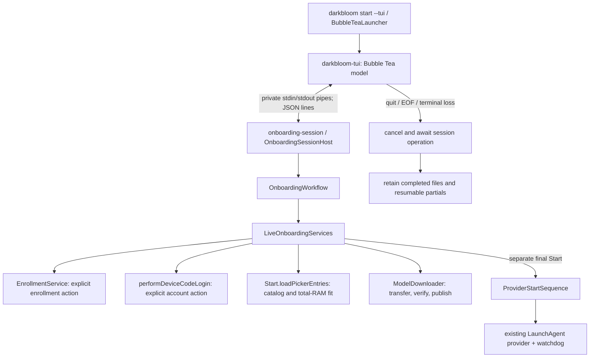

# Provider onboarding session

> Last updated: 2026-09-07 · commit `4314668d6`

The opt-in `darkbloom start --tui` frontend runs Bubble Tea while a foreground
session in the existing Swift executable owns onboarding. The provider still
runs independently through its existing launchd and watchdog sequence.

## Context

The [interface design](../../design/provider-ui-shared-swift.md) selects a
foreground session because downloads may stop when the frontend closes.
`ProviderCore` still contains inference dependencies; this change does not
create a shared application framework or a permanent management service.
The [Mac test guide](../../developer/onboarding-test.md) separates automated
fixture checks from human-operated installation and signed qualification.

## Mechanism

`BubbleTeaLauncher` resolves the current Swift executable through
`LaunchAgent.currentExecutablePath`, follows the installation symlink, and
executes its fixed sibling `darkbloom-tui`. Go launches that Swift executable's
hidden `onboarding-session` command without a shell or PATH lookup. The child
has its own process group and private pipes, with no listener or socket.

The contract is in
`provider-swift/Sources/darkbloom/OnboardingSession/OnboardingContract.swift`
(`OnboardingContract`), mirrored by `provider-tui/protocol.go` (`command`,
`event`). Version `1` uses UTF-8 JSON lines. Commands are at most 16,384 bytes;
events are below 262,144 bytes. Command IDs are positive increasing integers
up to 2,147,483,647. After `hello`, each action uses the revision from the last
snapshot. Unknown actions/fields, invalid selections, malformed/oversized
commands and incompatible versions fail without executing an operation.

| Action | Required state and result |
|---|---|
| `hello` | First command; observes enrollment/account/process facts. Fetches the catalog when prerequisites are satisfied. Opens no Settings/browser and never starts serving. |
| `refresh` | Re-observes prerequisites and catalog. Pending enrollment remains pending until macOS confirms it. Returns to model selection when prerequisites are satisfied; never restores Start consent. |
| `enroll` | Enrollment or pending-enrollment screen; explicitly requests the existing enrollment service to download/open its profile. Returns to the macOS approval instructions. |
| `link` | Account screen with actual enrollment confirmed; explicitly opens device-code login. Only the human code, verification URL and expiry reach Go. Credentials remain in Swift's existing token store. |
| `select_models` | Model screen; `modelIDs` must be unique catalog rows (at most 128) with at least one fitting model. Saves intent, downloads missing selections, verifies, publishes, then shows Ready. |
| `start` | Ready screen and current revision; rechecks actual enrollment, account, catalog, runtime eligibility and downloaded files. Calls the shared launch/watchdog sequence with fitting selections only. |
| `cancel` or command EOF | Cancels and awaits the active operation, closes the session and releases its locks. An incomplete final line is discarded. Never invokes provider Stop. |

Events are `snapshot`, `progress`, `link_code`, or `error`. Snapshot phases are
`enrollment`, `enrollment_pending`, `account`, `models`, `downloading`, `ready`,
and `started`. `providerRunning` is a separate observation matched against the
reported daemon process identity; `observedAt` timestamps the observation.
`started` reports a launch request, not ready models or accepted network trust.
A `watchdog_unavailable` notice preserves the existing best-effort watchdog
behavior while keeping its failure visible.

Progress distinguishes `transferring`, `verifying`, `publishing`, and
`completed`. Byte totals alone never advance onboarding to Ready. Go displays
the latest file progress; Swift owns both artifact integrity and eligibility.

While `enrollment_pending`, the frontend schedules a `refresh` every two
seconds after the preceding snapshot. It suppresses checks during another
operation and discards timers from an older revision. Confirmed macOS enrollment
advances the screen, but browser login still requires Enter. The header and
five-step indicator in `provider-tui/layout.go` (`setupHeader`) remain visible
along with the primary action while the body scrolls.

## Invariants

1. **Consent lives in the workflow.** `OnboardingWorkflow.handle` checks phase,
   revision and prerequisites. Connecting, completing downloads, stale Start,
   cancellation and EOF never provide final Start consent.
2. **One setup writer.** `ProviderOperationLock.setup` excludes simultaneous
   sessions. `onboardingCommandLease` in `provider-swift/Sources/darkbloom/main.swift`
   applies the same gate to ordinary start, stop, restart, enrollment, login,
   logout, unenrollment, model download and removal. Foreground serving and the
   Go launcher do not hold this gate. Config updates retain
   `OnboardingConfiguration.saveCoordinator` and its reload-under-lock behavior.
3. **One writer per model destination.** `ProviderOperationLock.model` covers
   `downloadForStorage`, `prefetch`, and `remove`. Locks live outside removable
   model directories, are close-on-exec, and are released by the kernel on
   process death. Contention fails promptly; the frontend can retry.
4. **Cancellation retains resume data.** `OnboardingSessionHost` cancels and
   awaits operation tasks before releasing the setup lease. The existing HTTP
   transfer cancellation and stable `.part` files remain in use. Cancellable
   `WeightHasher` calls stop between read chunks without interpreting cancellation
   as corrupt data. Integrity failures still follow existing cleanup rules.
5. **Output cannot hold cancellation hostage.** `OnboardingPipe` reads commands
   independently of its nonblocking writer. Progress coalesces, control events
   queue at most 32 frames, and a blocked write expires after two seconds. Go
   closes command input on quit before waiting for terminal restoration. A
   stuck child gets a bounded exit grace period, then signals target only that
   child, never the independently launched provider.
6. **Management does not expose inference authority.** The session does not
   initialize a provider loop, enclave identity, signer, APNs host, or KV reader.
   It disables core dumps and discards existing service prose streams. Only
   allowlisted errors are encoded; tokens, HTTP error bodies, raw diagnostics,
   sign/decrypt/unwrap operations and consumer contents are absent. Session mode
   still runs in the signed provider executable with its entitlements; this is
   source separation, not OS privilege isolation. The existing
   [encryption boundary](../security/encryption.md) is unchanged.
7. **One installed release.** `darkbloom-tui` is signed as
   `io.darkbloom.onboarding` without provider keychain, APNs or debugger
   entitlements, sealed at `Contents/MacOS/darkbloom-tui`, and notarized with the
   app. `OnboardingCompanionVerifier`, the installer, and update/rollback checks
   require its capability marker and CLI capability together. Older bundles
   without that capability remain valid. The companion has no updater.

## Failure modes

A missing companion makes `--tui` fail with a plain-CLI/build instruction.
An occupied setup gate returns `busy`; close the other session and reopen.
Network or account-code failures preserve intent and require another explicit
action. Cancelled downloads retain their partials; select the same models to
resume. Unexpected enrollment/account changes require refreshing prerequisites.
An unknown runtime capability fails toward download-only eligibility.

The frontend sanitizes terminal control characters in remote names, URLs,
codes and file labels. A broken frontend or saturated reader ends session work;
it does not trigger serving recovery. Use existing `darkbloom status`, `doctor`,
`stop`, and `restart` commands for provider lifecycle and trust diagnostics.

## Code map

| Concern | Source |
|---|---|
| Contract and workflow | `provider-swift/Sources/darkbloom/OnboardingSession/OnboardingContract.swift` (`OnboardingContract`), `OnboardingWorkflow.swift` (`OnboardingServices`, `OnboardingWorkflow`) |
| Host and transport | `provider-swift/Sources/darkbloom/OnboardingSession/OnboardingSessionHost.swift` (`run`), `OnboardingPipe.swift` (`OnboardingPipe`) |
| Live adapters | `provider-swift/Sources/darkbloom/OnboardingSession/LiveOnboardingServices.swift` (`LiveOnboardingServices`) |
| Terminal frontend | `provider-tui/model.go` (`Update`), `view.go` (`View`), `backend.go` (`startBackend`) |
| Shared catalog and launch | `provider-swift/Sources/darkbloom/Onboarding/ModelPickerLoading.swift` (`loadPickerEntries`), `ProviderStartSequence.swift` (`start`) |
| Disposable verification | `scripts/onboarding/test-session.py` (`ContractClient`, `TerminalTests`), `session-fixture.swift` (`FixtureServices`) |

## Related

- [Provider components](provider.md)
- [Provider CLI reference](../../provider/cli-reference.md)
- [Build and test](../../developer/build.md)
