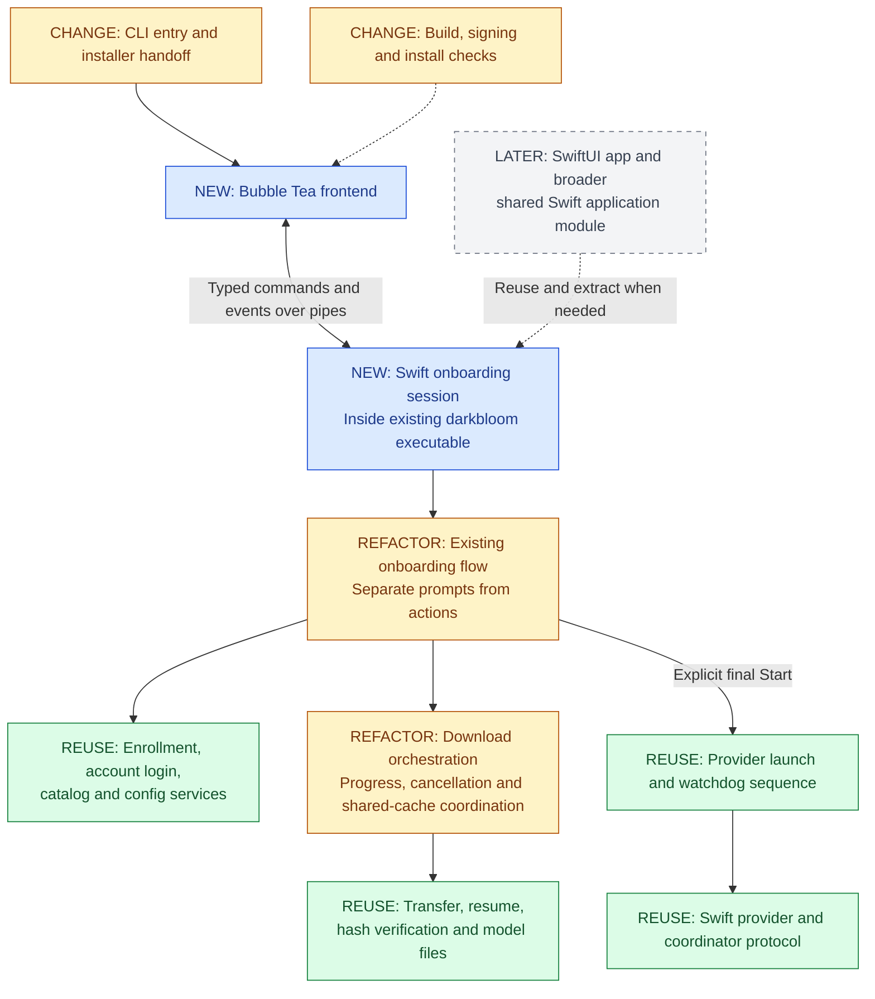
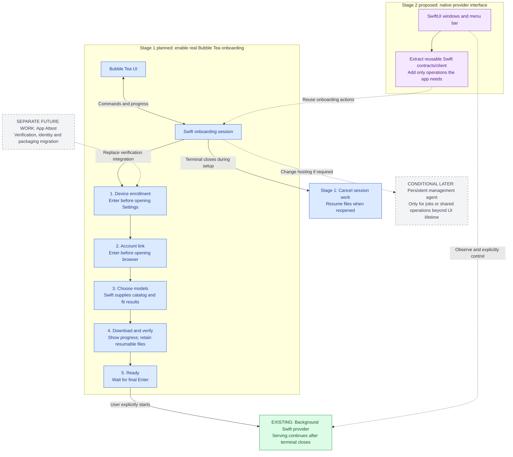

# Shared Swift foundation for provider interfaces

> Last updated: 2026-09-07 · commit `25aa5b0b9`

Status: **In progress** · 2026-09-07 · stage-one implementation is in the onboarding fork; signed human qualification is pending. See the [implemented session](../architecture/components/provider-onboarding.md).

Build real Bubble Tea onboarding with a narrow session in the existing Swift
executable, reusing the current service implementations. A unified shared Swift
application-services layer does not exist on this branch and is not a stage-one
deliverable.
The future native app should be a controller for the independently running
provider, with windows and menu-bar controls. Reuse the provider's existing
service lifetime and recovery machinery. Isolate verification and OS integration
behind small interfaces; do not attempt to prebuild the macOS 27 migration.

## Sources and scope

Audience: future agents and contributors planning or implementing the provider
interfaces. Read this page for the agreed direction and stage boundaries; read
the [research and review record](../reports/2026-09-07-provider-interface-architecture-research.md)
for the detailed source findings, alternatives, review challenges and open
questions. This is a design record, not documentation of a shipped bridge.

The authoritative descriptions of the existing system are
[provider components](../architecture/components/provider.md),
[provider attestation](../architecture/security/attestation.md),
[identity binding](../architecture/security/identity-binding.md), and
[encryption](../architecture/security/encryption.md). This page records a
proposal and does not replace those architecture pages. The required current
onboarding behavior is in the repository's [AGENTS.md](../../AGENTS.md) and
[physical Mac test guide](../developer/onboarding-test.md).

Product decisions supplied by the owner:

- V1 proves real onboarding through Bubble Tea using existing Swift services.
- The macOS app will become the primary provider interface. Keep stage one
  focused on the minimum useful Bubble Tea integration; preserve Swift logic
  for reuse without extracting a broad application framework in advance.
- Closing the frontend stops its downloads cleanly; reopening reuses completed
  and partial files. Downloads need not continue without a frontend in v1.
- The provider is not App Sandboxed.
- App Attest on macOS 27 is the intended native-app verification path. Its
  integration may change substantial implementation and packaging. Isolate
  those changes rather than require complete future compatibility now.

## What comparable apps establish

Primary documentation and source were inspected on 2026-09-07. These examples
establish useful patterns, not a universal process layout to copy.

| Example and evidence | Observed structure | Application to Darkbloom |
|---|---|---|
| Ollama: [desktop supervisor](https://github.com/ollama/ollama/blob/main/app/server/server.go), [app lifecycle](https://github.com/ollama/ollama/blob/main/app/cmd/app/app.go), [API client](https://github.com/ollama/ollama/blob/main/api/client.go) | The desktop app supervises a separate bundled `ollama serve` subprocess; app shutdown cancels it. The CLI uses an API client. | Interface and engine are separate responsibilities. App-owned supervision is one valid lifetime, but Darkbloom already has OS-managed serving. |
| LM Studio: [0.4.0 architecture change](https://lmstudio.ai/blog/0.4.0), [headless operation](https://lmstudio.ai/docs/developer/core/headless), [CLI connection code](https://github.com/lmstudio-ai/lms/blob/main/src/createClient.ts) | The core is available as standalone `llmster`; the desktop also has a background mode. CLI daemon startup and HTTP inference-server startup are distinct operations. | A service can remain useful without a visible window. Separate runtime availability, loaded models and enabled endpoints in the product state. |
| Tailscale: [daemon/platform structure](https://tailscale.com/docs/reference/tailscaled) | macOS GUI variants load a bundled executable in different process contexts for GUI, extension and CLI responsibilities. | Code modules, executable packaging and process boundaries are separate decisions. Darkbloom does not need Tailscale's network extension merely to run background inference. |
| Docker Desktop: [client/server architecture](https://docs.docker.com/get-started/docker-overview/#docker-architecture), [Mac permissions and backend](https://docs.docker.com/desktop/setup/install/mac-permission-requirements/) | The CLI reaches an Engine API; macOS adds a VM, host backend and narrowly scoped privileged integration. | Shared commands are established practice. Extra service processes should have a concrete lifetime, privilege or isolation purpose. |

These apps do not prove that every UI uses exactly the same transport or attaches
to one identical process in every installation mode. Our foreground pipe bridge
is a Darkbloom-specific simplification justified by the selected download
lifetime. Also, local inference products do not establish Darkbloom's privacy
policy: management interfaces must not acquire consumer plaintext access.

Apple's [background-process guidance](https://developer.apple.com/documentation/appkit/managing-ongoing-background-processes-in-your-mac)
supports persistent launch agents, requires background work to be controllable,
and recommends testing when users disable background activity. The future app
should adopt [SMAppService](https://developer.apple.com/documentation/servicemanagement/smappservice)
for its bundled per-user agent during the native packaging work. That is a
service-registration API, not evidence that inference is running or ready.
An ordinary app-bundled [XPC service](https://developer.apple.com/documentation/xpc)
has a client-associated lifetime; using XPC as a transport does not by itself
make the provider independent of the UI. A launch agent can also expose XPC.

## Existing code and extent of change

No Bubble Tea runtime code has been implemented in this branch. Only the design
has changed. Every stage below is proposed. `ProviderCore` and individual Swift
services already exist; a UI-neutral application facade, onboarding session
protocol and Go frontend do not.

The graph colors describe **change size/type**, not implementation completion:
green = existing code reused largely unchanged; amber = existing code requiring
substantive changes; blue = new stage-one code; gray = deferred. Node labels also
carry that distinction so color is not the only cue.

Green does not promise zero changed lines: integration can move a call or add
an adapter. It means the behavior and implementation are retained. Amber marks
work that should not be described as a cosmetic wrapper or a small edit.

| Current component | What stage one changes |
|---|---|
| `StartCommand+Daemon.swift`, `GuidedOnboarding`, `EnrollmentFlow`, `AccountLinkFlow` | Replace direct terminal interaction on the Bubble Tea path with explicit actions/events; retain prerequisite checks and consent. Reuse one implementation of decisions across the plain and new UI paths. |
| `ModelPickerCatalog`, `ModelPickerPolicy` | Expose existing Swift results to Go; preserve eligibility rules. Go owns selection rendering and input. |
| `ModelDownloader+Download.swift`, `ModelSelectionDownloads` | Separate rendering from work, report transfer/verification/publication, propagate cancellation, coordinate competing cache writers. Existing resume and integrity mechanisms remain. |
| `LaunchAgent`, `WatchdogAgent`, `OnboardingStartup` | Call the existing launch sequence from the Swift executable and project startup observations. Do not build a general lifecycle API or migrate service registration in stage one. |
| CLI entry, release workflow and installer | Add opt-in routing to the Go companion, include it in the signed release, and preserve plain commands and install/update behavior. |
| Broad shared Swift application module | Deferred. New session types and adapters can remain focused files in the existing CLI target. Extract a standalone module when the native app needs it. |

## Product architecture and state ownership

The macOS product has two main long-lived roles: the optional interface app and
the provider service. Darkbloom already has the latter, plus its watchdog and an
optional privileged fan helper. Add reusable management code before adding
another persistent process.

The proposed session contract expresses product intent, such as confirm account linking,
select models, cancel download, or start serving. It is not a Go API, a terminal
screen description, or an attestation protocol. SwiftUI can render a different
journey without copying the underlying prerequisites and side effects.
Only introduce commands for supported features; this diagram is not a mandate
to implement a dashboard or every lifecycle command in the onboarding PR.

### Reusable pieces

| Responsibility | Reuse and ownership |
|---|---|
| Management types and workflow | New dependency-light Swift types, explicit actions, prerequisite checks, progress stages, errors and cancellation. UI frameworks and MLX are absent. |
| Catalog and model policy | Reuse Swift catalog resolution, total-RAM fit rules and download-versus-serve eligibility. Both UIs consume results instead of independently estimating eligibility. |
| Model files | Reuse resumable downloads, hashing and atomic publication; remove terminal rendering from the downloader. Cross-process file locks cover foreground downloads and provider prefetch. |
| Settings and setup intent | Reuse existing config and onboarding stores. Serialize mutations, reload before writing and preserve unrelated fields. Do not add a second GUI database for provider settings. |
| Provider lifecycle | Share the complete start/stop/restart sequences, including watchdog ordering and persistent stop. Resolve the installed Swift executable explicitly; never infer it from a future GUI process. |
| Diagnostics | Project observed process, connectivity, model, resource and verification facts into snapshots. Preserve source and freshness. Local token counts are not an earnings ledger; future earnings come from coordinator accounting. |
| macOS integration | Small adapters for service registration, browser/Settings handoff and installation paths. OS callbacks stay out of workflow logic. Power and fan activity leases follow serving work, not window lifetime. |
| Inference runtime | Reuse the existing provider intact. MLX, scheduler, encrypted cache, coordinator connection and crypto remain its responsibility. |

These are logical boundaries, not eight stage-one deliverables or new packages.
Start with focused session/contract files and live adapters in the existing CLI
target. Keep contract and workflow files free of terminal, SwiftUI and MLX
dependencies so they can be extracted later. The future GUI can share those
Swift types and a lightweight client without importing `ProviderCore`. A native
in-process host is an option only after live dependencies are deliberately
extracted. Stage one does not require that wider decomposition.

Use separate state slices for (1) operator intent, (2) observed provider state,
and (3) the current management operation. A download can run while a provider
is already serving; one giant onboarding/provider enum would hide that fact.
There is one authority per fact: the current session owns operation progress,
existing stores own persisted intent/config, the provider owns runtime facts,
and the coordinator owns accepted trust/routing and credited earnings.

In SwiftUI, a small UI model observes these snapshots and sends actions. Views
own selection, focus and navigation, not the provider's business state. Apple's
[model-data guidance](https://developer.apple.com/documentation/swiftui/managing-model-data-in-your-app)
supports separating observable data from views. Sharing Swift code does not
share an actor or memory between processes; file mutations still need the same
cross-process gate regardless of which UI called them.

## Delivery stages and the provider journey

This second graph colors **delivery scope**: green = existing serving baseline;
blue = planned stage one; purple = proposed native-app stage; gray dashed =
separate future work or conditional scope. These are not completed milestones.
Stages describe dependencies, not a requirement to delay the parallel app work.

In stage one, the session runs inside the existing Swift executable and talks
to the Go companion over JSON lines on pipes. The numbered steps are visible
in Bubble Tea, while Swift performs the actual operations. Swift checks actual
state and skips enrollment or linking actions that are already satisfied;
completed-install updates continue to bypass onboarding. No new permanent
process is installed for onboarding. Closing a session does not stop a provider
that the operator already started.

The future SwiftUI client can initially use the same backend implementation,
with its own session. This does not imply simultaneous pipes to one server.
Stage one permits one active mutating setup session and returns a busy result
to a conflicting session. A shared running job is a different requirement from
sharing the code that implements it.

The minimum first release also includes the Go build/package path and focused
workflow, protocol, download and terminal verification. These are part of making
the visible flow real, even though they are not extra onboarding screens.

The GUI must not become a second supervisor. Keep today's launchd/watchdog/
updater ownership, including the updater's existing lease and drain/rollback
behavior. Keep the optional root fan helper narrow; ordinary management remains
in the user's account. No sandbox is required to make these structural choices.

### When a permanent manager becomes justified

Add one when a committed feature needs management jobs to survive all clients,
GUI/CLI attachment to the same ongoing operation, or substantial centralized
policy that the existing runtime and stores cannot own clearly. Merely having
both a GUI and CLI does not meet that threshold: both can observe the provider,
while conflicting mutations serialize or return busy.

Then host the same application services in a per-user management agent and
connect both clients to it. Add job persistence, reconnection, operation
ownership and version handling in that work. A Unix socket suits direct Swift
and Go clients; XPC is attractive for a predominantly native client surface.
If XPC is chosen, Go can keep a small Swift transport adapter. Do not implement
both now, and do not claim replacing pipes with a socket alone solves service
lifetime. Also do not expose the management API on the local inference HTTP
listener merely because that listener already exists.

### macOS lifecycle from the provider's perspective

These are proposed product semantics, not claims that a GUI already implements
them. Existing CLI start/stop behavior is preserved.

| Action or event | Behavior |
|---|---|
| Open app / attach CLI | Observe first. Opening an interface does not enroll, link an account or start inference. |
| Close GUI window | The app may remain in the menu bar, still owning its session. Provider serving is independent of window visibility. |
| Close terminal / quit its owning frontend | Cancel and await session work; preserve partial and verified model files. An explicitly started provider continues. The native app must make that continued activity clear and controllable. |
| Stop serving | Use the shared stop sequence, including disarming recovery and persistently disabling startup. Opening the app or logging in again must not undo Stop. A temporary Pause mode is separate future behavior. |
| Login / logout | Existing serving intent may resume at login. A per-user agent is not a pre-login system service; logout ends that session. |
| Disable background activity in System Settings | Show the disabled/approval-needed state. Do not repeatedly register or restart around the user's choice. Service approval, process liveness and readiness are separate facts. |
| Sleep / wake / network loss | Provider owns reconnection and current power policy. Refresh observations on wake; do not restart merely because status is stale. Always-on intent is not a guarantee of serving during system sleep. |
| Update / crash | Observe existing updater and recovery state. One installed release owns the Swift backend and Go companion; do not add a GUI updater or restart loop. Detect incompatible session/backend versions clearly. |

The native app should provide a visible status/stop affordance and distinguish
closing a window, quitting its interface and stopping serving. Final wording
and whether Quit offers both choices belong to GUI design. No foreground UI
should be required for the provider's own recovery to work.

## Isolating macOS 27 changes

Keep one small device-verification dependency with required action, progress,
failure and observed acceptance. Implement the existing path once. Do not build
parallel unused implementations, a universal attestation protocol or a second
identity store. Apple documents the intended future mechanism in its
[WWDC26 App Attest session](https://developer.apple.com/videos/play/wwdc2026/201/).

The likely replacement area includes proof generation, coordinator validation,
provider identity binding, enrollment UX and signing/entitlement packaging.
Those changes may cross process boundaries. Authenticating a GUI alone does not
establish the identity of the process receiving inference plaintext, so that
binding still needs a dedicated design when the migration is implemented.

Catalogs, model-file integrity, settings, download cancellation, workflow action
handling, diagnostics and lifecycle intentions need no App Attest-specific
implementation today. The aim is to keep those responsibilities reusable, not
promise unchanged APIs or packaging in macOS 27. Preserve current APNs/bundle/
notification restrictions while that provider path exists; do not promote them
to permanent requirements of the future GUI.

## Review findings and first-version responses

Three independent reviews covered service reliability/security, Swift/macOS
integration, and UX/testing/release delivery. The consequential findings are:

| Challenge | Minimum response |
|---|---|
| A permanent manager adds startup, recovery and upgrade behavior before background operations are required. | Use client-owned sessions with explicit cancel/EOF handling and the existing resume files. |
| `LaunchAgent.installAndStart` and watchdog setup derive the current executable path. Calling them from a GUI could install the GUI as the provider. | Keep the live adapter in `darkbloom`; preserve the existing inference launch target. Make executable resolution explicit before any future target split. |
| `ProviderCore` links inference libraries and `Start.run` prepares runtime resources before onboarding. | Keep new session/workflow contract files free of inference and terminal dependencies. Reuse focused adapters instead of wrapping all of `Start.run`; defer the broader module extraction until a native client needs it. |
| Existing terminal detection gates enrollment/login confirmation. Pipes can bypass those UI checks. | Explicit domain actions and backend prerequisite/phase checks. Connecting or reading status performs no browser, profile or provider-start action. |
| Foreground downloads and provider prefetch have different in-process owners but share cache destinations. | Per-model cross-process locking below the frontends; preserve existing config locking and exclude conflicting setup sessions. Actors alone cannot serialize different processes. |
| Manifest downloads instantiate a terminal renderer. | Separate progress from presentation. Preserve transfer, verification and publication stages; reaching total bytes is not verified completion. |
| Python preview scenes independently reproduce workflow. | Drive actual Go components with fixtures and actual Swift workflow with injected services. Share protocol fixtures across languages. |
| New binaries can complicate signed identity and rollback. | One separately signed Go helper at a fixed bundle path, no provider keychain/APNs/debug entitlements, one app release and updater, plain CLI compatibility. |

## Security constraints on the management surface

The operator controls the frontend. Treat its messages as untrusted input,
including messages from another same-user process. Neither pipes nor Unix
socket permissions make the caller trustworthy with consumer secrets.

For the current provider, preserve the documented inference identity and
plaintext boundary. The session must not construct `ProviderLoop`, an
attestation signer/builder, a persistent enclave key or KV-cache readers.
Status uses reported public identity rather than initializing or repairing it.

Expose product actions for setup, enrollment, account linkage, catalog selection,
downloads, cancellation and explicit start. Do not expose signing, decryption,
key unwrap, attestation challenge relay, arbitrary file or shell access, raw
credentials, inference bodies or unrestricted diagnostic dumps. Resolve
selected catalog IDs and artifact checks in Swift; do not accept client-supplied
manifests, expected hashes, runtime capabilities or trust verdicts.

The session is still part of the signed executable and carries its entitlement.
Module separation is not OS privilege isolation. Bound input, use explicit
command dispatch, sanitize errors, and handle account credentials without log
or protocol disclosure. Do not assume serving-mode hardening runs automatically
in session mode. A separate management executable without provider keychain
entitlement can be evaluated if the API grows substantially.

Expose observed trust facts with timestamps and unknown/pending states. The
current `TrustStatusMessage` is not the complete coordinator routing verdict.
Hardware trust plus a loaded model must not become an invented assertion that
all private-routing gates passed. The future App Attest UI follows the same
principle: server acceptance is distinct from local proof generation.

## Scope and verification

The first implementation includes the current real enrollment, account linkage,
multiple-model selection/download and final Enter-to-start flow behind an
opt-in Bubble Tea frontend. Preserve neutral styling, selective bold, green
success/red errors, plain commands and completed-install update behavior.

Acceptance cases:

- Enrollment and browser linkage require their respective Enter action; final
  start requires a separate explicit action. EOF, cancellation, stale commands
  and download completion never substitute for it.
- Swift retains total-physical-RAM model-fit policy and the distinction between
  downloadable and serveable models. Partial downloads resume with existing
  integrity verification.
- Concurrent setup and conflicting model-cache writes fail or serialize
  predictably. Existing CLI paths that can race setup must honor the same gates;
  a frontend-only lock is insufficient. Ending a management session cancels its
  work and leaves an already started provider running.
- Unknown/oversized/malformed commands and version mismatch fail clearly.
  Status never creates identity and management requests never expose crypto
  operations or inference data. Slow rendering does not block cancellation
  indefinitely.
- Swift workflow tests use injected services; Go tests exercise real components;
  cross-language fixtures cover the contract. A client independent of Bubble
  Tea exercises that contract to establish future SwiftUI usability.
- Disposable PTY tests cover input, resize, EOF/Ctrl-C and terminal restoration.
  Installer handoff, unattended install and completed-install update checks
  remain valid.
- Local builds establish UI/workflow behavior only. The human operates actual
  installer/reset/enrollment/login/start prompts under the repository test
  guide. Signed identity and network trust remain separate qualification.

Defer App Attest implementation itself, a permanent manager, background
downloads without a frontend, multi-client operation handoff, event replay,
XPC, generic RPC/plugin infrastructure, dashboard/earnings/fan controls and
independently released Go binaries.

## Code map

These are existing sources inspected for the proposal, not new implementation.

| Concern | Existing source |
|---|---|
| Workflow, consent and resume | `provider-swift/Sources/darkbloom/StartCommand+Daemon.swift`, `provider-swift/Sources/darkbloom/Onboarding/` |
| Launch identity | `provider-swift/Sources/ProviderCore/Service/LaunchAgent.swift` (`installAndStart`), `provider-swift/Sources/ProviderCore/Service/WatchdogAgent.swift` |
| APNs and crypto boundary | `provider-swift/Sources/darkbloom/ProviderAppKitHost.swift`, `provider-swift/Sources/ProviderCore/ProviderLoop+AttestationChallenge.swift` (`answerCodeChallenge`) |
| Identity and cache unwrap | `provider-swift/Sources/ProviderCore/Security/PersistentEnclaveKey.swift`, `provider-swift/Sources/ProviderCore/KVCache/SecureEnclaveKeyWrappingService.swift` |
| Downloads and concurrent prefetch | `provider-swift/Sources/ProviderCore/Models/ModelDownloader+Download.swift`, `provider-swift/Sources/ProviderCore/Server/ModelPrefetchCoordinator.swift` |
| Diagnostic facts | `provider-swift/Sources/ProviderCore/Service/DaemonStateFile.swift`, `coordinator/protocol/messages.go` (`TrustStatusMessage`) |
| Packaging and tests | `.github/workflows/release-swift.yml`, `scripts/install.sh`, `scripts/onboarding/prepare-candidate.py`, `scripts/test-install-onboarding.py` |

## Starting point for a separate implementation task

The inspected implementation base is fork `0xkydo/d-inference`, branch
`codex/cli-onboarding-m3-local`, commit
`fdb2edd2839af0a66208563dd67971a1122ba217`. This documentation was prepared on
`codex/bubbletea-swift-onboarding-v1`; that branch name does not mean runtime
implementation exists. This task records the direction only. The owner will
give a separate implementation command for another clone/worktree.

The implementation task should:

1. Read this record, its research companion, the target checkout's `AGENTS.md`
   and `docs/developer/onboarding-test.md`. Revalidate code findings against the
   selected base; do not assume these dated observations describe newer code.
2. Use a separate clean branch/worktree and bring these docs with it if they
   have not landed in the chosen base. Do not rely on a temporary local path or
   this conversation to retrieve the design.
3. Implement stage one only: real Bubble Tea onboarding, narrow Swift session,
   targeted prompt/progress separation, cancellation/resume and packaging.
   Broader shared modules, native UI, a permanent manager and App Attest are
   not implicit acceptance requirements.
4. Preserve the plain CLI and existing service/identity ownership. Test the
   command contract and actual workflow before the human-operated signed
   onboarding qualification. Never treat a local UI build as trust evidence.
5. Report implemented behavior separately from remaining design. When changes
   ship, update the relevant as-built architecture/reference pages and this
   record's status according to `docs/AGENTS.md`.

At handoff, documentation lint and whitespace checks have passed. No runtime
implementation, signed onboarding qualification, provider release or production
mutation was performed for this architecture record.
